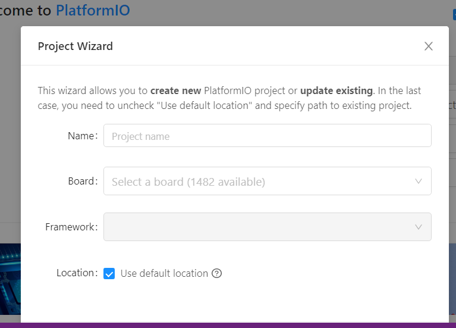
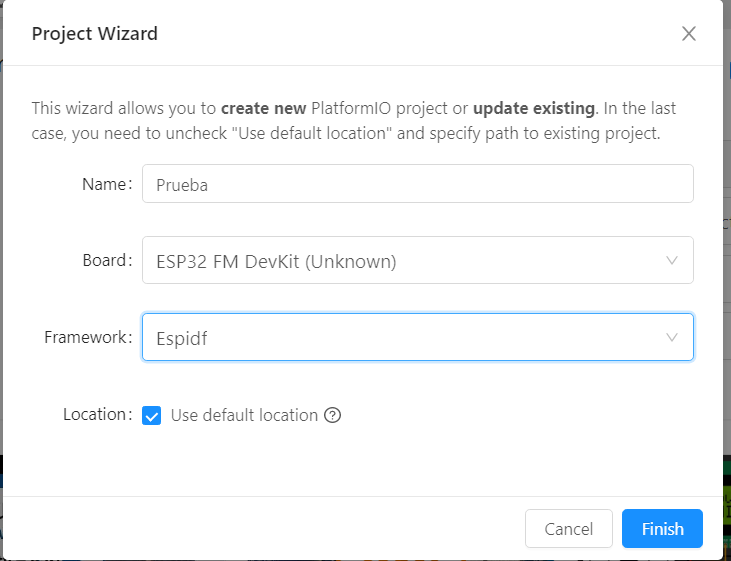

# Crear un nuevo proyecto con PlatformIO

1. Dar clic en "+ New Project".
	
2. Dar un nombre al proyecto en el campo *Name:*.
3. En la lista desplegable del campo *Board:* buscar y seleccionar la opción *"ESP32 FM DevKit (Unknown)"*, puede escribirlo con su teclado hasta que le aparezca la coincidencia. Esto debido a que los módulos comerciales que usaremos pueden ser de variadas referencias. 
4. En la lista desplegable del campo *Framework* seleccionar *"Espidf"*.
5. En el campo *Location* puede dejarlo marcado o no. Si decide desmarcarlo, deberá seleccionar el lugar donde desea guardar su proyecto. 
6. Luego dar clic en el botón *Finish*.
    
7. Luego de esto le aparecerá el siguiente mensaje:
    
8. Espere hasta que se terminen de descargar los archivos necesarios. Le recomiendo que lea los mensajes subsiguientes que le irá mostrando el programa durante la instalación, aunque estos son meramente informativos. 
9. Luego de haber terminado de configurarse el proyecto, deberá aparecer la siguiente vista: 
    