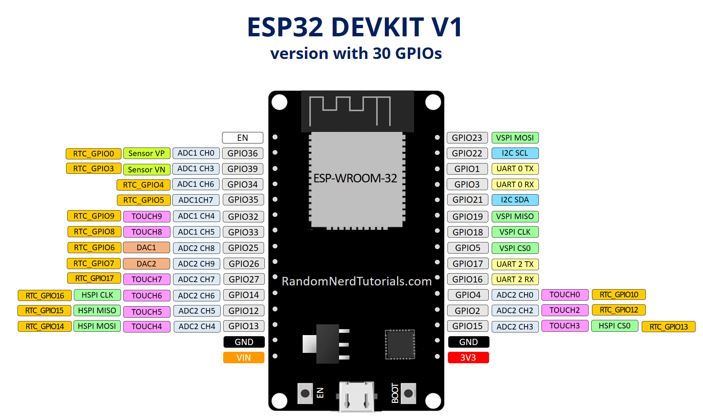

# **1.10.1. Algoritmos y ejercicios Práctica 1**

## **Objetivo**

Introducir al estudiante en el uso de la placa de desarrollo basada en ESP32, a través de la implementación de programas básicos.

## **Materiales**

***Hardware***

- 1 Computador.
- 1 Placa de desarrollo basada en ESP32 (cualquiera que tenga a disposición).
- 1 Cable de programación.
- 1 Protoboard.
- 3 LED's.
- 3 Resistencias de 220 Ohms.

***Software***

- IDE *Visual Studio Code (VSCode)*, 
- Extensión de VSCode *PlatformIO*. A través de esta extensión tiene acceso a:
	- Framework ESP-IDF que esencialmente contiene la API (bibliotecas de software y código fuente) para la ESP32 y scripts para operar la *Toolchain* para compilar código.
	- Herramientas de compilación para crear una aplicación completa para ESP32.
		- CMake, and 
		- Ninja.

Para realizar una instalación limpia de este software, por favor vlla a la [Guía de instalación](1.9_guia_instal_tools.md).

## **Introducción**

***ESP32***

Como se explicó antes, el SoC ESP32 es un sistema de doble núcleo con dos *CPU Harvard Architecture Xtensa LX6*. Toda la memoria integrada, la memoria externa y los periféricos se encuentran en el bus de datos y/o el bus de instrucciones de estas CPU. Además, integra las siguientes características:

- WiFi (banda de 2,4 GHz).
- Bluetooth.
- Coprocesador de ultra bajo consumo.
- Múltiples periféricos.

Para más información, [consultar la documentación de ESPRESSIF](https://docs.espressif.com/projects/esp-idf/en/latest/esp32/)

Existen muchas tarjetas de desarrollo en el mercado, basadas en ESP32. Una de las más comunes es la placa denominada DevKit basada en la ESP32-WROOM-32. De esta placa existen también muchas versiones. Dependiendo de la versión que haya adquirido, tendrá alguna diferencia en cuanto a la distribución de pines (*pinout*), posibilidades de conectividad, funcionalidades, entre otras. 

En este curso usaremos alguna versión del DevKit ESP32-WROOM-32. 

***¿Cómo energizar la placa?***

Para energizar la placa de desarrollo bastaría con conectarla con el cable USB la computador, como se muestra a continuación. Esta conexión, también permite la programación de la placa, siempre y cuando el computador al que se conecte cuente con el software requerido para esto. 

*Figura 1. Conección de la placa.*

Sin embargo, esta forma de energizar la placa sólo es útil mientras se está en la fase de desarrollo. Por lo tanto, para energizar la placa en la etapa de prototipado, se pude hacer a través de alimentación de:

- Pines de 5V y GND, que permite una alimentación con 5 V DC. En algunas placas aparece como *VIN*.
- Pines de 3V3 y GND, que permite una alimentación con 3.3 V DC. 

***Pinout***

A continuación, se muestra el pinout de una placa ESP32 DevKit V1 y ESP32 DevKit V4. En este se puede observar la distribución y la funcionalidad de cada uno de los pines. 

### **Ejercicio 1**

Por favor siga la siguiente metodología.

1. Inicie el programa VSCode y cree un nuevo proyecto con la herramienta platformIO siguiendo los pasos de la sección [Crear un nuevo proyecto con platformIO](/Unidad_1/0_nuevo_proyecto.md).
	
2. Cuando se haya creado el proyecto, despliegue la carpeta "src", donde está el archivo "main.c" que es el archivo principal del proyecto. En este archivo se escribirá el programa. 

3. Escriba el siguiente código dentro del archivo "main.c", cuyo objetivo es simple: encender un led cuando se presiona un botón.

	~~~
	// Llama a la librería GPIO
	#include "driver/gpio.h" 		
	
	// Crea una macro para indicar el pin donde se conectará el botón
	#define BUTTON 4
	
	// Crea una macro para indicar el pin donde se conectará el botón
	#define LED 2
	
	// Función principal. En esto difiere de un programa en C propiamente dicho.
	void app_main(void)
	{
		// Configuración de los pines
		gpio_reset_pin(BUTTON);  // Reiniciar el pin del botón (GPIO4) para que esté en su estado predeterminado 
		
		// Configura el pin del botón (GPIO4) como entrada
		gpio_set_direction(BUTTON, GPIO_MODE_INPUT);
		
		gpio_reset_pin(LED);     // Reiniciar el pin del LED (GPIO2) para que esté en su estado predeterminado  
		
		// Configura el pin del LED (GPIO2) como salida
		gpio_set_direction(LED, GPIO_MODE_OUTPUT);
		
		// Bucle infinito que permite que el programa se ejecute indefinidamente.
		while(1){
			// Lee el estado del botón y actualizar el estado del LED
			gpio_set_level(LED, gpio_get_level(BUTTON));
		}
	}

	~~~

4. La configuración del hardware que usted debe tener es la siguiente:
	
	

	Tenga en cuenta que si tiene otra distribución de pines, las líneas de código correspondientes a las macros para para la designación de los pines deberían coincidir con el número del pin correspondiente:
	
	~~~
	#define BUTTON 4
	#define LED 2
	~~~

5. En la parte inferior de Visual Studio Code hay una serie de botones, se describen los más relevantes:

	

	*Barra de herramientas de PlatformIO.*

	1. *"Build"*. Compilar el proyecto.
	1. *"Upload"*. Cargar el proyecto a la placa.
	1. *"Serial monitor"*. Abrir un monitor serial.

6. Compile el proyecto usando el botón *"Build"*. La primera vez puede ser demorado ya que crea todos los archivos del proyecto. Si todo es correcto, se obtiene un mensaje similar al siguiente:

	
	
7. Luego dar clic en *"Upload"* para subir el programa a la placa Si todo es correcto, se obtiene un mensaje similar al siguiente:

	

8. Cuando presione el botón, el led debería encender. Si lo libera, el led se apagará. Cuando termine, guarde el programa. 
	
	
### **Ejercicio 2**

1. Cree un nuevo proyecto con la herramienta PlatformIO como se vio antes. [Si tiene dudas consulte aquí](/Unidad_1/0_nuevo_proyecto.md).
	
2. Cuando se haya creado el proyecto, despliegue la carpeta "src", donde está el archivo "main.c" que es el archivo principal del proyecto. En este archivo se escribirá el programa. 

3. Escriba el siguiente código dentro del archivo "main.c", cuyo objetivo es: hacer que un LED realice un parpadeo.
	

	~~~
	// Incluir librería del sistema operativo FreeRTOS
	#include "freertos/FreeRTOS.h" 
	  
	// Incluir librería para manejo de tareas del FreeRTOS
	#include "freertos/task.h" 

	// Incluir librería de control de pines GPIO del ESP-IDF
	#include "driver/gpio.h"                        

	// Crea macro con el número del pin del LED que se utilizará
	#define LED  2
	 
	// Crea una macro que indica el tiempo de espera (WAIT)                            
	#define WAIT 1000                               

	// Función principal del programa
	void app_main(void)                             
	{
		// Reiniciar el pin LED para que esté en su estado predeterminado
		gpio_reset_pin(LED);                        
		gpio_set_direction(LED, GPIO_MODE_OUTPUT);  // Configurar el pin LED como salida

		// Bucle infinito que permite que el programa se ejecute indefinidamente.
		while(1){                                   
			gpio_set_level(LED, 0);                 // Apagar el LED
			vTaskDelay( WAIT / portTICK_PERIOD_MS); // Esperar N milisegundos
			gpio_set_level(LED, 1);                 // Enciende el LED
			vTaskDelay( WAIT / portTICK_PERIOD_MS); // Esperar N milisegundos
		}
	}
	~~~

4. La configuración del hardware que usted debe tener es la siguiente:
	
	

	Tenga en cuenta que si tiene otra distribución de pines, las líneas de código correspondientes a las macros para para la designación de los pines deberían coincidir con el número del pin correspondiente:
	
	~~~
	#define LED 2
	~~~
	
5. Siga los pasos 5. a 8. del ejercicio 1.

## **Práctica**

### **P1. Ejercicios varios**

1. Se tiene un nibble representado por 4 LEDs y un pulsador conectados a un uC.
Cuando la entrada conectada al pulsador está en 1, se deben encender todos los LEDs.
Cuando la entrada conectada al pulsador está en 0, se deben encender los dos MSB.

2. Detectar un pulso digital de un pulsador (P1) que cambie el ciclo de encendido/apagado de tres LEDs (L1, L2, L3). Las secuencia es la siguiente:
	- Encender L1, demorar un tiempo encendido, luego apagar L1.
	- Encender L2, demorar un tiempo encendido, luego apagar L2.
	- Encender L3, demorar un tiempo encendido, luego apagar L3. -
	- Al apagar L3, se debe reiniciar la secuencia al encender L1.
	- Cuando P1 esté presionado, la secuencia se debe invertir.

3. Se debe contar las veces que un pulsador P1 se presiona. La salida deben ser un número BCD representado por 4 LEDs.

### **P2. Pensamiento matemático**

1. Se puede calcular el cuadrado de un número N al sumar los N primeros números impares, así 7 al cuadrado es igual a 1+3+5+7+9+11+13 = 49, donde la serie del 1 al 13 son los primeros 7 números impares. Describir una solución para el microcontrolador que calcule el cuadrado de un número de 2 bits en la entrada usando el algoritmo descrito anteriormente. Note que el cuadrado de un número de 2 bits es en general de 4 bits.

# Referencias

- [1] ESPRESSIF.  https://docs.espressif.com/projects/esp-idf/en/latest/esp32/api-reference/peripherals/gpio.html
- [2] ESPRESSIF. https://docs.espressif.com/projects/esp-idf/en/latest/esp32/
