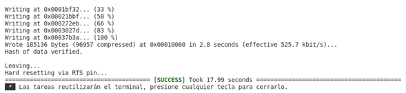
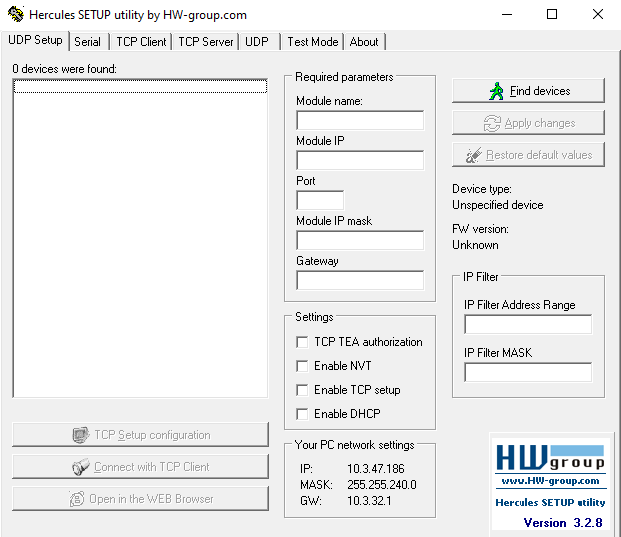
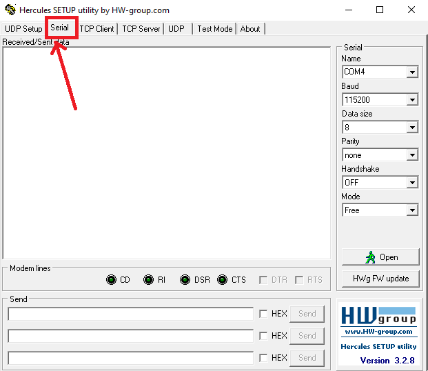

# **1.10.1. Algoritmos y ejercicios Práctica 2**

## **Objetivo**

Introducir al estudiante en el uso de la placa de desarrollo basada en ESP32, a través de la implementación de programas básicos.

## **Materiales**

***Hardware***

- 1 Computador.
- 1 Placa de desarrollo basada en ESP32 (cualquiera que tenga a disposición).
- 1 Cable de programación.

***Software***

- IDE *Visual Studio Code (VSCode)*, 
- Extensión de VSCode *PlatformIO*. A través de esta extensión tiene acceso a:
	- Framework ESP-IDF que esencialmente contiene la API (bibliotecas de software y código fuente) para la ESP32 y scripts para operar la *Toolchain* para compilar código.
	- Herramientas de compilación para crear una aplicación completa para ESP32.
		- CMake, and 
		- Ninja.
- [Hercules](https://www.hw-group.com/software/hercules-setup-utility).

Para realizar una instalación limpia de este software, por favor vlla a la [Guía de instalación](1.9_guia_instal_tools.md).

## **Introducción**

***Las funciones en C***

En la programación informática, las funciones suelen encapsular una operación más o menos compleja de la que se deriva un resultado. Para ejecutar esta operación, las funciones pueden precisar la invocación de otras funciones (o incluso de ellas mismas como es el caso de las funciones recursivas) [[1]](#referencias).

Las funciones en un programa son entidades que reciben parámetros (datos de entrada), realizan una tarea específica y se espera de ellas un resultado. Lo idóneo es dividir tareas complejas en porciones más simples que se implementan como funciones. La división y agrupación de tareas en funciones es uno de los aspectos más importantes en el diseño de un programa [[1]](#referencias).

Las funciones en C tienen el siguiente formato:

~~~C
tipo_del_resultado NOMBRE(tipo_param1 param1, tipo_param2 param2, ... ) 
{
    /* Cuerpo de la función */
}
~~~

*Tomado de: [[1]](#referencias).*

Cuando se invoca una función se asignan valores a sus parámetros y comienza a ejecutar el cuerpo hasta que se llega al final o se encuentra la instrucción *return*. Si la función devuelve un resultado, esta instrucción debe ir seguida del dato a devolver [[1]](#referencias). Por ejemplo:

~~~C
int search(int table[], int size) 
{
    int i, j;
    if (size == 0) 
    {
        return 0;
    }
    j = 0;
    for (i = 0; i < size; i++) 
    {
        j += table[i];
    }
    return j;
}
~~~

*Código tomado de: [[1]](#referencias).*

La llamada a una función se codifica con su nombre seguido de los valores de los parámetros separados por comas y rodeados por paréntesis. Si la función devuelve un resultado, la llamada se reemplaza por su resultado en la expresión en la que se incluye. Por ejemplo:

~~~C
int addition(int a, int b) 
{
    return (a + b);
}
int main() 
{
    int c;
    c = c * addition(12, 32);
}
~~~

*Código tomado de: [[1]](#referencias).*

### **Ejercicio 1**

Por favor, siga la siguiente metodología.

1. Inicie el programa VSCode y cree un nuevo proyecto con la herramienta platformIO siguiendo los pasos de la sección [Crear un nuevo proyecto con platformIO](/Unidad_1/0_nuevo_proyecto.md).
	
2. Cuando se haya creado el proyecto, despliegue la carpeta "src", donde está el archivo "main.c" que es el archivo principal del proyecto. En este archivo se escribirá el programa. 

3. Escriba el siguiente código dentro del archivo "main.c", cuyo objetivo es: Imprimir por puerto serial un mensaje. Entre cada impresión existe un tiempo de espera.

	~~~C

	#include <stdio.h>             // Biblioteca estándar de C para entrada/salida
	#include "driver/gpio.h"       // Biblioteca de funciones para interactuar con los pines GPIO
	#include "freertos/FreeRTOS.h" // Biblioteca para programación multitarea en ESP32
	#include "freertos/task.h"     // Biblioteca para crear tareas en ESP32

	#define ESPERA 500

	void app_main(void)
	{
		while(1){
			printf("Hola mundo\n");
			vTaskDelay( ESPERA / portTICK_PERIOD_MS);
		}
	}

	~~~

4. La configuración del hardware que usted debe tener es la siguiente:
	
	- Sólo necesita mantener conectado el cable de programación al computador ya la placa.

5. En la parte inferior de Visual Studio Code hay una serie de botones, se describen los más relevantes:

	

	*Barra de herramientas de PlatformIO.*

	1. *"Build"*. Compilar el proyecto.
	1. *"Upload"*. Cargar el proyecto a la placa.
	1. *"Serial monitor"*. Abrir un monitor serial.

6. Compile el proyecto usando el botón *"Build"*. La primera vez puede ser demorado ya que crea todos los archivos del proyecto. Si todo es correcto, se obtiene un mensaje similar al siguiente:

	
	
7. Luego dar clic en *"Upload"* para subir el programa a la placa Si todo es correcto, se obtiene un mensaje similar al siguiente:

	

8. Luego puede usar cualquier programa para leer el puerto serial del computador. Sin embargo, se le recomienda [Hercules](https://www.hw-group.com/software/hercules-setup-utility). 
	- Hercules es un software portable (no requiere instalación). Para los usuarios de Windows, luego de descargar el archivo, para ejecutarlo puede hacer doble clic.
	- Al ejecutarlo, se le mostrará la siguiente vista:
		
	- Valla a la pestaña "Serial" que se encuentra en la parte superior izquierda de la ventana de Hercules. De clic en ella y se mostrará la siguiente vista:
		
	- Luego, en el panel derecho denominado "Serial", configure la comunicación UART. En esta guía no se profundizará en la comunicación UART, que se dejará para guías posteriores. Simplemente, siga las siguientes recomendaciones:
		- Elija el Puerto COM al que está conectada la tarjeta ESP32. Para los usuarios de Windows, esto lo puede averiguar en la "Administración de Dispositivos".
		- Luego configure cada uno de los campos como se muestra a continuación:
			
	- Posteriormente, de clic en el botón Open del panel "Serial". Esto abrirá el puerto serie y podrá transmitir y recibir con la placa ESP32 a través de comunicación UART. 
	- El resultado de este proceso deberá ser:
		
	
	
### **Ejercicio 2**

1. Cree un nuevo proyecto con la herramienta PlatformIO como se vio antes. [Si tiene dudas consulte aquí](/Unidad_1/0_nuevo_proyecto.md).
	
2. Cuando se haya creado el proyecto, despliegue la carpeta "src", donde está el archivo "main.c" que es el archivo principal del proyecto. En este archivo se escribirá el programa. 

3. Escriba el siguiente código dentro del archivo "main.c", cuyo objetivo es: 
	1. Imprimir por serial un mensaje.
	1. Usar la función uart_write_bytes(), que proporciona la HAL del dispositivo.
	1. Definir un tiempo de espera entre cada impresión.
	

	~~~C
	#include <stdio.h>              // Biblioteca estándar de C para entrada/salida
	#include <string.h>             // Biblioteca estándar de C para manejo de strings
	#include "driver/gpio.h"        // Biblioteca de funciones para interactuar con los pines GPIO
	#include "freertos/FreeRTOS.h"  // Biblioteca para programación multitarea en ESP32
	#include "freertos/task.h"      // Biblioteca para crear tareas en ESP32
	#include "driver/uart.h"        // Biblioteca para usar las funciones del UART del ESP32

	#define TIEMPO      1000
	#define BUF_SIZE    1024

	static void uart_init();

	void app_main(void)
	{
		char* string_test = "Hola, mundo\n";
		uart_init();

		while(1){
			uart_write_bytes(UART_NUM_0, (const char*)string_test, strlen(string_test));
			vTaskDelay( TIEMPO / portTICK_PERIOD_MS);
		}
	}

	static void uart_init(){
		
		uart_config_t uart_config = {
			.baud_rate = 115200,
			.data_bits = UART_DATA_8_BITS,
			.parity    = UART_PARITY_DISABLE,
			.stop_bits = UART_STOP_BITS_1,
			.flow_ctrl = UART_HW_FLOWCTRL_DISABLE,
			.source_clk = UART_SCLK_DEFAULT,
		};

		ESP_ERROR_CHECK(uart_driver_install(UART_NUM_0, BUF_SIZE * 2, 0, 0, NULL, ESP_INTR_FLAG_IRAM));
		ESP_ERROR_CHECK(uart_param_config(UART_NUM_0, &uart_config));
		ESP_ERROR_CHECK(uart_set_pin(UART_NUM_0, 1, 3, 22, 19));

	}
	~~~

4. La configuración del hardware que usted debe tener es la siguiente:
	
	- Sólo necesita mantener conectado el cable de programación al computador ya la placa.
	
5. Siga los pasos 5. a 8. del ejercicio 1.

## **Práctica**

### P1. 

Desarrolle un algoritmo que sea capaz de imprimir por serial el tiempo transcurrido en milisegundos desde que se conecta una tarjeta de desarrollo ESP32. Un ejemplo del formato de salida serial es:

~~~
Tiempo transcurrido desde el inicio: 10 ms
~~~

Se recomienda usar la función *esp_timer_get_time()*, la cual está en la biblioteca *esp_timer.h*.

Esta función, Esta función devuelve el número de microsegundos desde que se inicializó esp_timer, lo que suele ocurrir poco antes de que se llame a la función app_main [[2]](#referencias).

En la referencia [[2]](#referencias), puede encontrar información adicional sobre la función. Sin embargo, su funcionamiento es simple.

### P2. 

Desarrolle un algoritmo que sea capaz de imprimir por serial el tiempo transcurrido en días (dd), horas (hh) minutos (mm), segundos (ss) y milisegundos (ms), desde que se conecta una tarjeta de desarrollo ESP32. El formato de salida serial debe ser:

~~~
Tiempo transcurrido desde el inicio: dd:hh:mm:ss,ms
~~~

Donde: 

dd:hh:mm:ss,ms
00:00:00:00,00

dd = días, hh = horas, mm = Minutos, ss = segundos y ms = milisegundos.

Se recomienda usar la misma función *esp_timer_get_time()*, empleada en el ejercicio anterior.

# Referencias

- [1] UC3M. https://www.it.uc3m.es/pbasanta/asng/course_notes/functions_es.html 
- [[2]] ESPRESSIF. *High Resolution Timer (ESP Timer)* (https://docs.espressif.com/projects/esp-idf/en/latest/esp32/api-reference/system/esp_timer.html)
