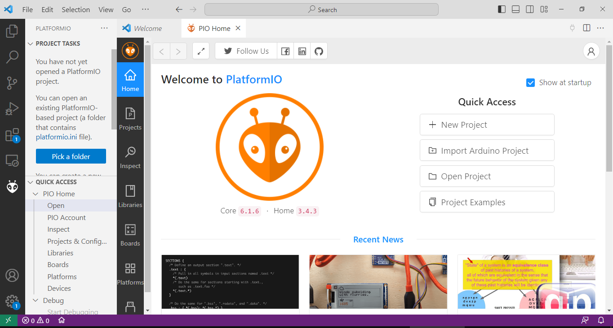

# Guía de instalación de las herramientas del curso

## Instalación de Visual Studio Code (VSCode)

1. Descargar el programa en la [página oficial  Visual Studio Code](https://code.visualstudio.com/download)
    - Seleccionar el instalador según su sistema operativo.

    

2. Seguir los pasos de instalación de Visual Studio Code para su sistema operativo:
    - [Instalar VSCode en Windows](https://www.youtube.com/watch?v=f2eDJva9f2Y)
    - [Instalar VSCode en Linux (Ubuntu)](https://www.youtube.com/watch?v=ROXcgWe3Fsc)
    - [Instalar VSCode en MAC](https://www.youtube.com/watch?v=Z4lTITfq3-0)

## Instalación y configuración de platformIO

1. Para instalar PlatformIO es necesario haber instalado Visual Studio Code.

2. Es necesario [instalar el intérprete de Python](https://www.python.org/downloads/).
    
    1. Seleccionar el instalador según su sistema operativo.
    2. [Instalar Python en Windows](https://www.youtube.com/watch?v=UPya-XsUlA4)
    3. [Instalar Python en Linux](https://www.youtube.com/watch?v=aicZINm0zs4)
    4. [Instalar Python en MAC](https://www.youtube.com/watch?v=itBE25gYEeY)

3. [Instalar PlatformIO en VSCode](https://www.youtube.com/watch?v=k5HMEl6epG4)

4. Configurar PlatformIO
    - Una vez instalado platformIO, dar clic en el ícono de la hormiga , el cual encuentra en la parte izquierda de la vista de VSCode.
    - Esto le abrirá la vista de Home:
    
    - Si no abre de esta forma, luego de haber dado clic en el ícono de la hormiga, haga clic en Open (parte inferior izquierda), como se ve en la imagen. Esto abrirá el Home.
    .
    - Para habilitar el toolchain de ESP-IDF. Debe contar con conexión a internet la primera vez que haga esta configuración. 
        - 1. Dar clic en "+ New Project".
        
        - 2. Dar un nombre al proyecto en el campo *Name:*.
        - 3. En la lista desplegable del campo *Board:* buscar y seleccionar la opción *"ESP32 FM DevKit (Unknown)"*, puede escribirlo con su teclado hasta que le aparezca la coincidencia. Esto debido a que los módulos comerciales que usaremos pueden ser de variadas referencias. 
        - En la lista desplegable del campo *Framework* seleccionar *"Espidf"*.
        - En el campo *Location* puede dejarlo marcado o no. Si decide desmarcarlo, deberá seleccionar el lugar donde desea guardar su proyecto. 
        - Luego dar clic en el botón *Finish*.
        
        - Luego de esto le aparecerá el siguiente mensaje:
        
        - Espere hasta que se terminen de descargar los archivos necesarios. Le recomiendo que lea los mensajes subsiguientes que le irá mostrando el programa durante la instalación, aunque estos son meramente informativos. 
        - Luego de haber terminado de configurarse el proyecto, deberá aparecer la siguiente vista: 
        

## Enlaces de interés

- [Índice general](/readme.md)
- [Unidad 1](/Unidad_1/readme.md)
- [Unidad 2](/Unidad_2/readme.md)
- [Unidad 3](/Unidad_3/readme.md)
- [Ir al inicio](#guía-de-instalación-de-las-herramientas-del-curso)

