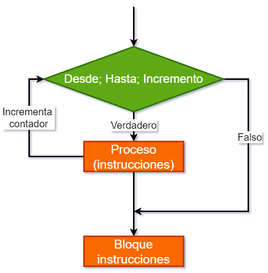

# Unidad 1 - Introducción a los Sistemas Embebidos

## Índice

- [1.1. Definición y Propiedades de los Sistemas Embebidos](#11-definición-y-propiedades-de-los-sistemas-embebidos)
- [1.2. Aplicaciones y diferencias entre Circuitos lógicos programables (CLP), microprocesadores y microcontroladores](#12-aplicaciones-y-diferencias-entre-circuitos-lógicos-programables-clp-microprocesadores-y-microcontroladores)
- [1.3. Introducción a la Arquitectura de microprocesadores](#13-introducción-a-la-arquitectura-de-microprocesadores)
- [1.4. Modelos de Arquitectura Harvard y Von Neumann](#14-modelos-de-arquitectura-harvard-y-von-neumann)
- [1.5. Tipos de set de instrucciones: RISC y CISC](#15-tipos-de-set-de-instrucciones-risc-y-cisc)
- [1.6. El concepto de Hardware Abstraction Layer](#16-el-concepto-de-hardware-abstraction-layer)
- [1.7. El concepto del lenguaje ensamblador](#17-el-concepto-del-lenguaje-ensamblador)
- [1.8. Proceso de compilación de lenguajes de alto nivel](#18-proceso-de-compilación-de-lenguajes-de-alto-nivel)
- [1.9. Introducción al lenguaje C](#19-introducción-al-lenguaje-cc)
- [Fundamentos de la sintaxis de C](#fundamentos-de-la-sintaxis-de-c)
	- [El primer programa en C](#el-primer-programa-en-c)
	- [Variables](#variables)
	- [Tipos de datos](#tipos-de-datos)
	- [Operadores básicos de C](#operadores-básicos-de-c)
	- [Funciones](#funciones)
	- [Sentencias de control](#sentencias-de-control)
		- [Condicionales simple: *if*](#if)
			- [if-else](#if-else)
		- [Encadenamiento de condicionales](#encadenamiento-de-condicionales)
		- [Anidamiento de condicionales](#anidamiento-de-condicionales)
	- [Ramificación: *switch-case*](#switch-case)
	- [Bucles](#bucles)
		- [*while*](#while)
		- [*for*](#for)
		- [Bucles infinitos](#bucles-infinitos)
	- [Algunas funciones útiles](#algunas-funciones-útiles)
		- [*printf()*](#printf)
		- [*scanf()*](#scanf)
	- [Macros](#macros)
	- [Estructuras de datos en C](#estructuras-de-datos-en-c)
		- [Arreglos](#arreglos-o-arrays)
		- [Vectores](#vectores)
		- [Matrices](#matrices)
		- [Inicialización de arreglos en C](#inicialización-de-arreglos-en-c)
		- [Acceso](#acceso)
- [1.9. Introducción al lenguaje C Práctica 1](#191-introducción-al-lenguaje-cc-práctica-1)
- [1.9. Introducción al lenguaje C Práctica 2](#192-introducción-al-lenguaje-cc-práctica-2)
- [1.10. Algoritmos y ejercicios de programación](#110-algoritmos-y-ejercicios-de-programación)
- [1.10. Algoritmos y ejercicios Práctica 1](#1101-algoritmos-y-ejercicios-práctica-1)
- [1.10. Algoritmos y ejercicios Práctica 2](#1102-algoritmos-y-ejercicios-práctica-2)
- [1.10. Algoritmos y ejercicios Práctica 3](#1103-algoritmos-y-ejercicios-práctica-3)
- [Referencias](#referencias)


## 1.1. Definición y Propiedades de los Sistemas Embebidos

### Sistema Embebido

Es un dispositivo electrónico con capacidad de computación que está diseñado para cumplir una labor específica en un producto. Comúnmente, un sistema embebido hace parte de un sistema más grande y complejo, por ejemplo vehículos (carros, motocicletas, aviones o naves espaciales), o incluso sistemas de la vida cotidiana, como lo son los electrodomésticos (lavadora, nevera o incluso la licuadora). 

El papel que desempeña un sistema embebido dentro del sistema mayor que lo contiene, comúnmente corresponde a la el control automático de todas o de una parte de las funciones del sistema anfitrión. Tales funciones pueden incluir el preprocesamiento de señales provenientes de sensores, control de actuadores y las comunicaciones inalámbricas. 

En las últimas décadas, la informática se ha convertido omnipresente en todo el mundo. Esta omnipresencia se puede palpar con la presencia de internet, la computación en la nube, los servidores globales, las computadoras portátiles, tabletas, teléfonos inteligentes y una inmensa variedad de dispositivos con capacidad de computación en todas partes [[1]](#referencias).


*Figura 1. Sistema de control de abordo de un vehículo. [Fuente: aa1car.com](https://www.aa1car.com/library/bywire2.jpg)*


*Figura 2. ECU Automotriz [Fuente: autosoporte.com](https://autosoporte.com/conociendo-los-circuitos-de-procesamiento-de-datos-de-una-ecu/)*


*Figura 3. FMC de un Avión. [Fuente: Hispaviacion.es](https://www.hispaviacion.es/el-fms-2/#:~:text=El%20FMC%20o%20Flight%20Management,sistema%20de%20gesti%C3%B3n%20de%20vuelo.)*


*Figura 4. Sistema de a bordo del satélite OPS-SAT de la Agencia Espacial Europea (ESA).  [Fuente: Telemadrid.es ](https://www.telemadrid.es/noticias/sociedad/La-Politecnica-desarrolla-un-software-para-mejorar-el-control-de-los-satelites-espaciales-0-2444755562--20220425070952.html)*


### 1.1.1. Características de los sistemas embebidos

La principal característica de los sistemas embebidos es que emplean diversos tipos de procesadores digitales o dispositivos electrónicos capces de ejercer una función de procesamiento. A continuación, se presentan las principales características de los sistemas embebidos:

1. Tienen un núcleo, que es el encargado de procesar los datos y/o controlar el sistema para el cual fue diseñado. Este núcleo puede estar basado en diversas tecnologías de sistemas digitales tales como:
    - Microprocesador
    - Microcontrolador
    - Procesador de Señales Digitales (DSP, Digital Signal Processor)
    - CPLD
    - FPGA
    - Lógica TTL, CMOS o ECL
2. Cumplen una función específica en un sistema más grande.
3. Pueden incluir una interfaz Humano/Máquina, que permite la interacción con el sistema. 
4. Incluyen periféricos de alto nivel como sensores, actuadores, pantallas, dispositivos de audio, módulos de comunicación, entre otros. 
4. Sus funciones típicas son el monitoreo, el control y las comunicaciones. 
5. Son reprogramables o reconfigurables. 
6. Son flexibles, debido a que se pueden diseñar para aplicaciones específicas. Sin embargo, también pueden ser diseñados para aplicaciones de consumo masivo. 
7. Son de tamaño reducido. Existen algunos estándares que permiten determinar el tamaño de la placa de circuito impreso, pero esta va a depender en todos los casos de las características de la aplicación específica. 
8. Tienen bajo consumo de energía. 
9. Dependiendo del tipo de dispositivo de procesamiento, se pueden usar lenguajes de programación de software de alto nivel o lenguajes de descripción de hardware. 

## 1.2. Aplicaciones y diferencias entre Circuitos lógicos programables (PLDs), microprocesadores y microcontroladores

### **1.2.1 Definiciones**

**Circuitos integrados de aplicación específica (ASICs)**
Aplication-Specific Integrated Circuit (ASIC). 

Son circuitos electrónicos integrados en un solo chip que están diseñados para implementar una solución específica [[2]](#referencias).

Los ASICs son una gran categoría de dispositivos y se pueden clasificar como sigue:

- Dispositivos lógicos programables. 
- Matrices de compuertas. 
- Celda estándar. 
- Totalmente personalizados.

**Circuitos lógicos programables (PLDs)**

Son dispositivos electrónicos que pueden configurarse a la medida para *crear cualquier circuito digital deseado*, desde simples compuertas lógicas hasta sistemas digitales complejos [[2]](#referencias). 

Los PLDs se pueden clasificar según los siguientes tipos:

- Dispositivos lógicos programables simples (SPLDs)
- Dispositivos lógicos programables complejos (CPLDs). 
- Matrices de compuertas programables en campo (FPGAs).


*Figura 5. CPLD Marca Altera. [Fuente: Wikipedia](https://es.wikipedia.org/wiki/CPLD#/media/Archivo:Altera_MAX_7128_2500_gate_CPLD.jpg).*


*Figura 6. FPGA. [Fuente: Mouser Electronics](https://co.mouser.com/new/xilinx/xilinx-virtex-ultrascale-vcu128-eval-kit/).*

**Microprocesador**

El microprocesador es un circuito integrado que tiene la capacidad de realizar operaciones lógicas y matemáticas, ejecutar programas, procesar datos de entrada-salida, y controlar el funcionamiento de un sistema electrónico [[3]](#referencias).. 

Sin embargo, para que el microprocesador realice sus funciones, es necesario conectarlo con más elementos, como memoria volátil, memoria no volátil (SSD o HHDD), circuitos de entrada/salida, reloj entre otros. 


*Figura 7. Microprocesador. [Fuente: Wikipedia](https://es.wikipedia.org/wiki/Microprocesador#/media/Archivo:AMD_X2_3600.jpg).*

**Microcontrolador**

Es un dispositivo electrónico que tiene la capacidad de realizar operaciones lógicas y matemáticas, ejecutar programas, procesar datos de entrada-salida, y controlar el funcionamiento de un sistema electrónico [[3]](#referencias). 

A diferencia del *microprocesador*, el microcontrolador ya incluye en un solo circuito integrado todos los elementos necesarios para ejecutar sus funciones: CPU, memoria, reloj oscilador y módulos I/O [[3]](#referencias).


*Figura 8. Microcontrolador PIC 18F8720. [Fuente: Wikipedia](https://es.wikipedia.org/wiki/Microcontrolador#/media/Archivo:PIC18F8720.jpg)*

**Sistema en un chip (SoC)**

El concepto de System-on-Chip (SoC), es *"simplemente"* un único circuito integrado que contiene cada uno de los elementos de una computadora. Sin embargo, los SoC no pueden acomodar suficiente memoria para un sistema operativo completo como Linux o Android y, por lo tanto, se debe proporcionar algo de memoria externa, a menudo además del propio SoC. [[1]](#referencias). Ejemplos de SoC bastante comerciales son: los ESP32 SoCs, ARM SoCs, Raspberry Pi SoCs, y otros. 

### **1.2.2. Aplicaciones de los sistemas Embebidos**

Las aplicaciones de los sistemas embebidos hoy en día se encuentran en muchos campos, tales son: 

- Equipos industriales de instrumentación y automatización.
- Aplicaciones militares.
- Equipos de comunicaciones.
- Bioingeniería y electromedicina.
- Vehículos para transporte terrestre, marítimo y aéreo.
- Vehículos y aplicaciones para el sector aeroespacial.
- Dipositivos para el sector de consumo: electrodomésticos, juguetes, electrónica de consumo.
- Educación. 

El presente curso se enfocará en el estudio y diseño de sistemas embebidos basados en microcontrolador. Esto, debido a su gran flexibilidad, bajo costo y demanda en diversas aplicaciones como el Internet de las Cosas (IoT), la domótica y el Edge Computing. 

## 1.3. Introducción a la Arquitectura de microprocesadores

### **1.3.1. Arquitectura básica computacional**

Todo sistema de computación básico se compone de los siguientes elementos.
- Procesador o microprocesador.
- Memoria no volátil.
- Memoria volátil.
- Bus de datos.
- Bus de control.
- Bus de direcciones.
- Interfaces:
    - Interfaz humano/máquina.
    - Interfaz de comunicación.
    - Interfaz de programación.
    - Interfaz de entrada/salida de propósito general. 

En la Figura 9 se puede apreciar un ejemplo de una arquitectura básica. Se ilustran tres ejemplos de interfaz para dispositivos de visualización o diferentes sensores/accionadores de datos, una interfaz de red (por ejemplo, Ethernet) y el control de un motor.


*Figura 9. Arquitectura básica computacional. Fuente: [[1]](#referencias).*

### **1.3.2. Arquitectura de un microporcesador**

A continuación, se muestra la arquitectura básica de un microprocesador: 


*Figura 10. Arquitectura básica de un Microprocesador. Fuente: [[3]](#referencias).*

La CPU es la Unidad Central de Procesos y está formada por la Unidad de Control, Registros y la Unidad de Procesos [[3]](#referencias).

La memoria se divide en memoria de programa y memoria de datos, en donde se almacenan las instrucciones de programa y los datos respectivamente [[3]](#referencias).

Los módulos de entrada/salida permiten intercambiar información con el mundo exterior.
Se requiere de un *clock* (reloj del sistema) debidos que para funcionar, todo el dispositivo debe estar sincronizado, esto posibilita que todos los módulos interactúen entre sí [[3]](#referencias). Los tres bloques principales deben estar vinculados mediante buses de comunicación, (bus de datos, bus de direcciones y bus de control), por donde viajan los datos digitales [[3]](#referencias).

## 1.4. Modelos de Arquitectura Harvard y Von Neumann

### **1.4.1. Arquitectura Von Neumann**

En este modelo la unidad central de proceso o CPU está conectada a una memoria única que contiene las instrucciones del programa y los datos (ver Figuras 11 y 12).


*Figura 11. Arquitectura Von Neumann, Simplificado. Fuente: [[4]](#referencias).*


*Figura 11. Arquitectura Von Neumann. Fuente: [[3]](#referencias).*

El tamaño de la unidad de datos o instrucciones está fijado por el ancho del bus de datos de la memoria exterior utilizada. Por ejemplo, dado el caso de un microprocesador con un bus de 8 bits, deberá manejar datos e instrucciones de una o más unidades de 8 bits (1 byte) de longitud. Cuando deba acceder a una instrucción o dato de más de un byte de longitud, deberá realizar más de un acceso a la memoria. Por otro lado este bus único limita la velocidad de operación del microprocesador, ya que no se puede buscar en la memoria una nueva instrucción antes de que finalicen las transferencias de datos que pudieran resultar de la instrucción anterior [[4]](#referencias). 

### **1.4.2. Arquitectura Harvard**

La arquitectura Harvard dispone de dos memorias independientes a las que se conecta mediante dos grupos de buses separados (ver Figuras 13 y 14) [[4]](#referencias).


*Figura 13. Arquitectura Harvard, Simplificado. Fuente: [[4]](#referencias)*.


*Figura 14. Arquitectura Harvard. Fuente: [Fuente: [3]](#referencias)*.

En la arquitectura Harvard los buses de datos y programa son totalmente independientes y pueden ser de distintos anchos. Esto permite que la CPU pueda acceder de forma independiente y simultánea a la memoria de datos y a la de instrucciones, consiguiendo que las instrucciones se ejecuten en menos ciclos de reloj [[4]](#referencias). 

## 1.5. Tipos de set de instrucciones: RISC y CISC

**¿Qué es un set de instrucciones?**

El *instruction set architecture* o en español set de instrucciones de la arquitectura es una especificación que define las instrucciones que "reconoce" y es capaz de ejecutar un microprocesador específico. Cada microprocesador, según su fabricante y según su arquitectura, tiene distintos tipos de instrucciones. Incluso, microprocesadores de las mismas familias pueden contener distintos sets de instrucciones. Estos sets de instrucciones, a menudo, especifican lo siguiente:
- Las instrucciones.
- Los registros especiales y de propósito general
- Tipos de datos o rangos de los registros.
- La arquitectura de memoria.
- Las interrupciones.

1. CISC (Complex Instruction Set Computer). Son procesadores con un juego de instrucciones complejo. Su repertorio de instrucciones es elevado y algunas de ellas son muy sofisticadas y potentes. Su problema es que requieren de muchos ciclos de reloj para ejecutar las instrucciones complejas [[4]](#referencias). Un ejemplo de este set de instrucciones es el de la arquitectura x86 [La cual puede consultar en este link de referencia](https://learn.microsoft.com/en-us/windows-hardware/drivers/debugger/x86-architecture)
2. RISC (Reduced Instruction Set Computer). Son microprocesadores con un repertorio de instrucciones reducido. Las instrucciones son muy simples y suelen ejecutarse en un ciclo máquina. Los procesadores RISC suelen tener una estructura Pipeline y ejecutar casi todas las instrucciones en el mismo tiempo [[4]](#referencias). En las Figuras 15 y 16 se pueden ver ejemplos de set de instrucciones reducidos.
3. SISC (Specific Instruction Set Computer). Estos procesadores poseen un juego de instrucciones específico para cada aplicación. Están destinados a aplicaciones muy concretas [[4]](#referencias). En la Figura 17 se puede ver parte del set de instrucciones del CPU TMS320C28x, de Texas Instrument.


*Figura 15. Set de instrucciones de un PIC16F84A. [Fuente: Microchip](https://ww1.microchip.com/downloads/en/devicedoc/35007b.pdf)*


*Figura 16. Set de instrucciones de los ARM Cortex M0, Cortex M3 y Cortex M4. [Fuente: [5]](#referencias)*


*Figura 17. Set de instrucciones del CPU TMS320C28x, de Texas Instrument. [Fuente: Texas Instrument](https://www.ti.com/lit/ug/spru430f/spru430f.pdf?ts=1690959208588&ref_url=https%253A%252F%252Fwww.google.com%252F)*

Los microprocesadores basados en arquitecturas SISC o RISC no han logrado mayor popularidad para emplearse en los ordenadores personales. Por el contrario, ha predominado los CISC, debido al aumento constante en la capacidad de procesamiento de estos. Es así que, el uso de microprocesadores basados en RISC y SISC se siguen limitado a necesidades muy específicas de procesamiento, como en los procesadores DSP.

## 1.6. El concepto de Hardware Abstraction Layer

Uno de los problemas más básicos al desarrollar software para un sistem-on_chip (SoC) está relacionado con la portabilidad del código. Esto último se refiere a la capacidad de un software para ejecutarse en distintas plataformas, en este caso, SoCs diferentes (o de distintos fabricantes). Esta es una cuestión fundamental para cualquier organización que desee invertir en el desarrollo de un sistema operativo (OS, *operating system*), que probablemente solo tenga alguna posibilidad comercial si puede ejecutarse en varias plataformas SoC, sin un esfuerzo y un gasto de desarrollo significativos. En tal escenario, el objetivo es hacer que el OS sea lo más abstracto posible con respecto al hardware subyacente. Para ello, los fabricantes de SoC's, desarrollan la "Capa de Abstracción de Hardware (*HAL, Hardware Abstraction Layer*), que consiste en un programa que implementa una serie de métodos (funciones, clases, estructuras, etc.) que permiten la virtualización del entorno de ejecución, lo que permite que un sistema operativo sea compatible con múltiples plataformas de SoC [[1]](#referencias).

De acuerdo con lo anterior, es posible decir el concepto de capa de abstracción de hardware o HAL, es un software que define e implementa todas las funciones requeridas para acceder al hardware de un microprocesador/microcontrolador o conjunto de ellos, típicamente del mismo fabricante. La HAL proporciona funciones de alto nivel al programador, de manera que éste no se preocupa por cómo debe acceder a memoria o los periféricos del hardware, sino que le proporciona una *interfaz* para que lo pueda hacer. 

No hay que confundir el concepto de HAL con el de kernel de un OS. El kernel por su parte, abstrae la administración de la CPU o *scheduling*, realiza la asignación de memoria, el sistema de archivos, entre otras funciones, que es lo mismo en diferentes tipos de CPU y hardware. Por otro lado, una HAL encapsula la lógica del controlador de diferentes CPU y hardware.

A continuación, se muestran las capas en las que se puede dividir un sistema embebido. Típicamente, todas las capas ya están dadas, y el usuario o programador hace uso de todas ellas en la capa de aplicación. 


*Figura 18. Capas de un sistema embebido. Fuente: Elaboración propia.*

## 1.7. El concepto del lenguaje ensamblador

Antes de definir el lenguaje ensamblador, debemos definir qué es el lenguaje máquina, ya que ambos están estrechamente relacionados. Pero mucho antes, debemos recordar qué es un lenguaje.

### **¿Qué es un lenguaje?**

La definición de lenguaje puede variar dependiendo del contexto en que se analice. Por lo tanto, se tratará de ser lo más superior posible en cuanto a esta definición. Así pues, se definirá lenguaje como un conjunto limitado o código de signos, con reglas de sintaxis y estructuras definidas, cuyo objetivo es permitir una comunicación efectiva entre dos o más entes o sujetos. 

Los lenguajes pueden abarcar distintos tipos de signos, tales como, visuales (gráficos, luces, gestos, etc.), auditivos o táctiles u otros relacionados con los sentidos o el pensamiento. De este modo, los lenguajes se pueden clasificar en: humano, animal y formal. Éste último es el que nos ocupará.

Por lo tanto, para efectos de ubicar el concepto de lenguaje en el contexto de los sistemas embebidos, se considerará que lenguaje es una construcción artificial humana que se usan en matemáticas y otras disciplinas formales, incluyendo la informática.

### **Lenguaje maquina:** 

También llamado código máquina. Es el sistema de codificación o lenguaje (si se quiere) que es directamente ejecutado por un microprocesador; de ahí viene la denominación "lenguaje máquina". Su composición se basa en los estados eléctricos de "encendido o apagado", lo que en términos binarios se conoce como "unos y ceros". Cualquier instrucción que deba ser ejecutada por el microprocesador debe estar expresada en binario.

### **Lenguaje ensamblador:** 

(Assembly languaje o assembler, del inglés), Es un lenguaje de programación de bajo nivel, que se usa para la programación de microprocesadores. Es un lenguaje muy cercano al código máquina, ya que cada instrucción se corresponde con un código máquina directamente (casi). 

Este lenguaje está basado en "mnemónicos" ya que sustituye una instrucción en código máquina por palabras o símbolos alfanuméricos más fáciles de recordar por el programador.


*Figura 19. Ejemplo de código máquina. [Fuente: Wikipedia](https://es.wikipedia.org/wiki/Lenguaje_de_m%C3%A1quina#/media/Archivo:Codigo_de_maquina.png)*

Lenguaje de máquina del Intel 8088. El código de máquina en hexadecimal en rojo, el equivalente en lenguaje ensamblador en magenta, y las direcciones de memoria donde se encuentra el código, en azul. Abajo se ve un texto en hexadecimal y ASCII [Fuente: Wikipedia](https://es.wikipedia.org/wiki/Lenguaje_de_m%C3%A1quina#/media/Archivo:Codigo_de_maquina.png).

Un programa escrito en Assembler típicamente tiene la extensión *.asm o *.s. Este programa se denomina código fuente y es dependiente de la arquitectura de microprocesador que se esté usando.
Algunas de las arquitecturas comunes en microprocesadores son:
- X86-64
- ARM
- PowerPC
- DEC Alpha
- MIPS
- PA-RISC

### **El programa ensamblador**

Es un software que se encarga de traducir el lenguaje ensamblador a lenguaje máquina. "Traduce" los **mnemónicos** y los convierte en *"opcode"* (código de operación). El Opcode saliente varía según el conjunto de instrucciones del microprocesador. Las operaciones pueden ser: aritméticas, lógicas, escritura o lectura de memoria y control del programa.

## 1.8. Proceso de compilación de lenguajes de alto nivel

**Compilar:** es el proceso de transformar un programa informático escrito en un lenguaje (llamado código fuente) en un conjunto de instrucciones en otro formato o lenguaje (llamado código objeto).

El resultado final de la compilación serán los archivos en código binario o "ejecutables" que serán cargados en la memoria de programa del microprocesador y que éste podrá ejecutar. 

De manera general, el proceso de compilación que se lleva a cabo como sigue:

- Preprocesamiento (Preprocesador) 
    - Análisis léxico: bien escrito
    - Análisis sintáctico: coherencia
    - Análisis semántico: verificación de tipos de datos
- Compilación (Compilador)
    - Generación de código intermedio
    - Optimización de código

- Ensamble (Ensamblador)
    - Generación de código máquina

- Enlazado (Linker)
    - Genera coherencia y cohesión en las instrucciones.
    - Generación de ejecutables.

A continuación, se muestra un diagrama del proceso y sus archivos producto. 


*Figura 20. Diagrama de componentes (UML) del proceso de compilación. Fuente: Elaboración propia.*

 ***Nota terminológica***. Al programa o software escrito para dispositivos electrónicos (como microprocesadores o microcontroladores) se le denomina *firmware*.

## 1.9. Introducción al lenguaje C/C++


El lenguaje de programación C o simplemente lenguaje C, es un lenguaje de programación desarrollado en 1972 por Dennis Ritchie y Brian Kernighan. Ambos escribieron el libro denominado *"The C Programming Language"* o en español *"El lenguaje de programación C"* [[6]](#referencias), el cual es una introducción general al lenguaje C. 

 

A continuación, algunas características del lenguaje C:

- Es un lenguaje de Alto nivel
- Es de Propósito general
- Débilmente tipado
- Estructurado
- Es sensible a mayúsculas

### **Fundamentos de la sintaxis de C**

Un programa en C consta de funciones y variables. Una función contiene sentencias o proposiciones que especifican las operaciones de cálculo que se van a realizar, y las variables almacenan los valores utilizados durante los cálculos. La función llamada ***"main"*** es especial, debido a que el programa comienza a ejecutarse al principio de main. Esto significa que todo programa debe tener una función main en algún sitio. Por general main llamará a otras funciones que ayuden a realizar su trabajo, algunas que usted ya escribió, y otras de bibliotecas escritas previamente [[6]](#referencias). 

**Resumiendo...** Todo programa escrito en C consta de una función principal llamada ***"main"*** y otras funciones. La función main es la primera que se ejecuta cuando el programa se ejecuta, a partir de ésta es posible "llamar" al resto de funciones que compongan el programa.

Se puede decir que en en la sintaxis de C existen 5 grandes grupos de elementos:

1. **Comentarios:** Permiten generar documentación del código sobre el propio código fuente. Los comentarios inician después de repetir dos veces el símbolo *--slash--*, que es este: **//**. Los comentarios son ignorados por el preprocesador, por lo tanto sólo tendrá validez para el programador en cuanto a guía u orientación. Ejemplo. 
    ~~~c
        // Esto es un comentario en el lenguaje C.
        int a = 3;  // Esto es otro comentario. 
    ~~~

1. **Directivas del preprocesador:** Son indicaciones concretas al compilador para la generación de código máquina. Algunas de las directivas del preprocesador de C son las siguientes. (Haga clic sobre cada directiva para encontrar una descripción relacionada)
    
    1. [#define](https://learn.microsoft.com/es-es/cpp/preprocessor/hash-define-directive-c-cpp?view=msvc-170)
    2. [#elif](https://learn.microsoft.com/es-es/cpp/preprocessor/hash-if-hash-elif-hash-else-and-hash-endif-directives-c-cpp?view=msvc-170)
    3. [#else](https://learn.microsoft.com/es-es/cpp/preprocessor/hash-if-hash-elif-hash-else-and-hash-endif-directives-c-cpp?view=msvc-170)
    4. [#endif](https://learn.microsoft.com/es-es/cpp/preprocessor/hash-if-hash-elif-hash-else-and-hash-endif-directives-c-cpp?view=msvc-170)
    1. [#error](https://learn.microsoft.com/es-es/cpp/preprocessor/hash-error-directive-c-cpp?view=msvc-170)
    1. [#if](https://learn.microsoft.com/es-es/cpp/preprocessor/hash-if-hash-elif-hash-else-and-hash-endif-directives-c-cpp?view=msvc-170)
    1. [#ifdef](https://learn.microsoft.com/es-es/cpp/preprocessor/hash-ifdef-and-hash-ifndef-directives-c-cpp?view=msvc-170)
    1. [#ifndef](https://learn.microsoft.com/es-es/cpp/preprocessor/hash-ifdef-and-hash-ifndef-directives-c-cpp?view=msvc-170)
    1. [#include](https://learn.microsoft.com/es-es/cpp/preprocessor/hash-include-directive-c-cpp?view=msvc-170)
    1. [#line](https://learn.microsoft.com/es-es/cpp/preprocessor/hash-line-directive-c-cpp?view=msvc-170)
    1. [#pragma](https://learn.microsoft.com/es-es/cpp/preprocessor/pragma-directives-and-the-pragma-keyword?view=msvc-170)
    1. [#undef](https://learn.microsoft.com/es-es/cpp/preprocessor/hash-undef-directive-c-cpp?view=msvc-170)

    Por ejemplo, una línea que aparece al principio de muchos archivos fuente de C, usa la directiva 
    ~~~c
    #include <stdio.h> 
    ~~~
    indica al compilador que debe incluir información acerca de la biblioteca estándar de entrada/salida [[6]](#referencias).

2. **Sentencias:** Son las instrucciones que el programador define y son las que indican la funcionalidad de un programa. Existen tres tipos de sentencias en C:
    1. **Sentencias de expresión:** Consiste en una expresión acabada con un punto y coma (;), la ejecución de esta hace que se evalúe la expresión [[7]](#referencias).
        Ejemplo:
        ~~~c
        int a;                  // Declaración de variable a
        a = 3;                    // Asignación de un valor a la variable a
        c = x + y;                  // Operación suma x + y, asigna el resultado a c
        printf("Suma=%d", c);    // Imprime por consola el resultado.
        ~~~
    1. **Sentencias compuestas:** Están formadas por varias sentencias individuales encerradas entre dos llaves({...}). Las sentencias individuales pueden ser a su vez sentencias de expresión, sentencias compuestas o sentencias de control. A diferencia de una sentencia de expresión, las compuestas no acaban con un punto y coma. Las sentencias compuestas hacen posible incluir unas sentencias dentro de otras [[7]](#referencias). Ejemplo:
        ~~~c
        {
            pi = 3.14;
            c = x + y;
            ++i;
        }
        ~~~
    1. **Sentencias de control:** se utilizan cuando deseamos conseguir ciertas acciones especiales en los programas, comprobaciones lógicas (como if-else), bucles (como while o for) y ramificaciones (como switch-case). Muchas sentencias de control necesitan que las otras modalidades de sentencias que tenemos, estén presentes dentro de ellas [[7]](#referencias). Para ampliar, diríjase a la sección [Sentencias de control](#sentencias-de-control))

3. **Funciones:** Son secciones de código que se ejecutan para una tarea determinada. Las proposiciones de una función están encerradas entre llaves { }. Ejemplo:
    ~~~c
    void main()
    {
        printf("hola, mundo\n");
    }
    ~~~

4. **Palabras reservadas:** Según el standard ANSI-C, el lenguaje C posee 32 palabras reservadas, a parte de las directivas del preprocesador. Estas son:

    |  |  |  |  |  |  |  |
    | --- | --- | --- | --- | --- | --- | --- |
    auto | break | case | char | const | continue | default |
    do | double | else | enum | extern | float | for |
    goto | if | int | long | register | return | short |
    signed | sizeof | static | struct | switch | typedef | union |
    unsigned | void | volatile | while |  |  |  |

### **El primer programa en C**

En C, el program a para escribir "hola, mundo" es [[6]](#referencias):

~~~c
#include <stdio.h>

void main()
{
    printf("hola, mundo\n");
}
~~~

La forma de ejecutar este program a epende del sistema operativo que se esté utilizando. Sin embargo, para simplificar el proceso de aprendizaje de la sintaxis de C, usaremos el compilador online [OnlineGDB](https://www.onlinegdb.com/online_c_compiler).

### **Variables**

Una variable es un espacio de memoria RAM (u otra), separado y etiquetado con un nombre. Las variables pueden ser globales o locales. 

En C, las variables deben ser declaradas antes de ser utilizadas. La declaración de una variable especifica su tipo y su nombre. La definición de una variable asigna un espacio de memoria para esa variable y opcionalmente le da un valor inicial.

Una **variable global** es aquella que es "reconocida" en todo el programa, es decir aquella que es posible usar dentro de todo el programa. Como buena práctica, las variables globales deberían declararse antes de la función main. De esta forma, la variable será reconocida en todo el programa. Así mismo, par que todas las funciones reconozcan la existencia de una variable local, también debería declararse dicha variable antes de la función. 

En el ejemplo de a continuación, se declaran como globales las variables *a* y *b*.

~~~c
#include <stdio.h>

int a = 1;
int b = 3;

int suma(int x, int y)
{
	return x + y;
}

void main()
{
	printf("Programa que suma dos números\n");
    printf("Suma = %d", suma(a, b));
}

~~~

Una **variable local** son aquellas que sólo son reconocidas en el ámbito de una función. En el ejemplo anterior, los parámetros *x* e *y* de la función *suma()*, son variables que sólo "existen" para esta función. Sin embargo, para ser más explícitos pero menos eficientes, se podría escribir el siguiente código, el cual tiene el mis comportamiento que el anterior.

~~~c
#include <stdio.h>

int a = 1;
int b = 3;

int suma(int x, int y)
{
	int z = 0; // Se declara una variable local z y se define su valor, en este caso 0. 
	z = x + y; // Se asigna a la variable z el resultado de la suma de x e y.
	return z;  // Se retorna el valor de z al terminar la función. 
}

void main()
{
	printf("Programa que suma dos números\n");
    printf("Suma = %d", suma(a, b));
}

~~~

Si se intentara llamar a las variables x, y o z desde la función main, el compilador de C nos devolvería el siguiente error: 
~~~ 
main.c:22:25: error: ‘x’ undeclared (first use in this function) 
~~~


### **Tipos de datos**

En C, los tipos de datos definen el tipo de valor que una variable puede contener y las operaciones que se pueden realizar en ese valor. Los tipos de datos en C se pueden dividir en varios grupos, que incluyen tipos básicos, tipos derivados y tipos enumerados. Aquí hay una descripción general de los tipos de datos más comunes en C:

1. **Tipos de datos básicos:**
   - **int:** Representa números enteros, por ejemplo, 1, 2, -5, etc.
   - **float:** Representa números de punto flotante (números reales), por ejemplo, 3.14, -0.5, etc.
   - **double:** Similar a float pero con mayor precisión, se utiliza para representar números de punto flotante de doble precisión.
   - **char:** Representa caracteres individuales, como 'a', 'b', '1', '@', etc.
   - **_Bool:** Representa valores booleanos, que pueden ser verdaderos (1) o falsos (0).
   - **void:** Es un tipo especial que indica la ausencia de tipo. Se utiliza principalmente en funciones que no devuelven ningún valor.

2. **Tipos de datos derivados:**
   - **Array:** Representa una colección de elementos del mismo tipo. Por ejemplo, `int numeros[5]` declara un array de enteros con 5 elementos.
   - **Pointer:** Almacena la dirección de memoria de otra variable. Por ejemplo, `int *ptr` declara un puntero a un entero.
   - **Struct:** Permite crear un tipo de dato compuesto que puede contener varios miembros de diferentes tipos.
   - **Union:** Similar a struct pero todos los miembros comparten la misma ubicación de memoria. Solo uno de los miembros puede contener un valor en un momento dado.

3. **Tipos enumerados (enum):**
   - **Enum:** Permite definir un conjunto de constantes enteras con nombres simbólicos. Por ejemplo, `enum semana {LUNES, MARTES, MIERCOLES, JUEVES, VIERNES, SABADO, DOMINGO};` define un nuevo tipo enum llamado `semana` con los valores `LUNES`, `MARTES`, etc.


### **Tamaño de los tipos de datos**

En C, el tamaño de los tipos de datos básicos puede variar de una plataforma a otra. Esta característica está detrás de buena parte de las críticas que recibe este lenguaje, pues de ella se derivan problemas de compatibilidad (una aplicación se comporta de forma diferente cuando se ejecuta en plataformas diferentes) [[13]](#referencias)..

A modo de ejemplo, en la siguiente tabla se incluyen los tamaños de los tipos de datos para las plataformas Linux/Intel i686.

| TIPO DE DATOS  | SE ESCRIBE | MEMORIA REQUERIDA\* | RANGO ORIENTATIVO\*        | EQUIVALENCIA EN PSEUDOCÓDIGO | OBSERVACIONES                                 |
|----------------|------------|---------------------|----------------------------|------------------------------|-----------------------------------------------|
| Entero         | int        | 2 bytes             | \- 32768 a 32767           | Entero                       | Uso en contadores, control de bucles etc\.    |
| Entero largo   | long       | 4 bytes             | \- 2147483648 a 2147483647 | Entero                       | Igual que int pero admite un rango más amplio |
| Decimal simple | float      | 4 bytes             | \- 3,4·1038 a 3,4·1038     | Real                         | Hasta 6 decimales\. También admite enteros    |
| Decimal doble  | double     | 8 bytes             | \- 1,79·10308 a 1,79·10308 | Real                         | Hasta 14 decimales\. También admite enteros   |
| Carácter       | char       | 1 bytes             | 0 a 255                    | Alfanumérica                 | Carácter, independiente o parte de una cadena |


### **Conversión de tipos de datos en C**

La conversión de un tipo de datos en otro se conoce como conversión de tipos o conversión de tipos (type casting). Por ejemplo, si desea almacenar un valor *'long'* en un número entero simple, se puede escribir *cast 'long' a 'int'¨*. Puede convertir los valores de un tipo a otro explícitamente usando el operador de conversión de la siguiente manera [[14]](#referencias):

~~~c
(nombre_del_tipo) expresión
~~~

Considere el siguiente ejemplo donde el operador de conversión hace que la división de una variable entera por otra se realice como una operación de punto flotante [[14]](#referencias):

~~~c
#include <stdio.h>

main() {

   int sum = 17, count = 5;
   double mean;

   mean = (double) sum / count;
   printf("Value of mean : %f\n", mean );
}
~~~

*Código tomado de: [[14]](#referencias)*+


### **Operadores básicos de C**

Los operadores en C son símbolos especiales que se utilizan para realizar operaciones en variables y valores. Categorizan y especifican cómo se deben realizar ciertas acciones dentro de una expresión. Estas operaciones pueden ser aritméticas, de comparación, lógicas, de asignación, entre otras. Aquí hay una descripción de los tipos de operadores más comunes en C:

| Símbolo | Descripción
| --- | --- |
| * | Multiplicación |
| / | División |
| %	| Módulo |
| + | Suma |
| -	| Resta |

| --- | Operadores de desplazamiento bit a bit |
| --- | --- |
| << | Desplazamiento a la izquierda |
| >> | Desplazamiento a la derecha |

| --- | Operadores relacionales |
| --- | --- |
| < | Menor que |
| > | Mayor que |
| <= | Menor o igual que |
| >= | Mayor o igual que |
| == | Igual que |
| != | Diferente de |

| --- | Operadores bit a bit |
| --- | --- |
| & | Operador AND bit a bit |
| ^	| Operador XOR bit a bit |
| &#124; | Operador OR bit a bit |

| --- | Operadores lógicos |
| --- | --- |
| && | Operador AND lógico. Genera el valor 1 si ambos operandos tienen valores distintos de cero.
| &#124;&#124; | El resultado es 0 si ambos operandos tienen valores 0. |


### **Funciones**

Una función en C es un bloque de código que realiza una tarea específica. Las funciones son fundamentales en C porque permiten organizar el código de manera modular y reutilizable. Cada función tiene un nombre único y puede recibir parámetros de entrada y devolver un valor de salida (aunque esto último no es obligatorio).

Una función en C se distingue sólo por su nombre. Dos funciones con igual nombre y con diferente número y tipo de parámetros se considera una definición múltiple, y por tanto un error [[12]](#referencias). 

Las funciones suelen encapsular una operación más o menos compleja de la que se deriva un resultado. Para ejecutar esta operación, las funciones pueden precisar la invocación de otras funciones (o incluso de ellas mismas como es el caso de las funciones recursivas) [[12]](#referencias).

Las funciones en un programa son entidades que reciben parámetros (datos de entrada), realizan una tarea específica y se espera de ellas un resultado. Lo idóneo es dividir tareas complejas en porciones más simples que se implementan como funciones. La división y agrupación de tareas en funciones es uno de los aspectos más importantes en el diseño de un programa [[12]](#referencias).

Las funciones en C tienen el siguiente formato:

~~~c
tipo_del_resultado NOMBRE(tipo_param1 param1, tipo_param2 param2, ... ) 
{
    /* Cuerpo de la función */
}
~~~

*Tomado de: [[12]](#referencias).*

**Ejemplo: **

~~~c
// Declaración de la función
int suma(int a, int b);

// Función principal
int main() {
    int resultado = suma(3, 5); // Llamada a la función
    printf("El resultado de la suma es: %d\n", resultado);
    return 0;
}

// Definición de la función
int suma(int a, int b) {
    return a + b;
}
~~~

En este ejemplo, suma es el nombre de la función. Toma dos parámetros de tipo `int` y devuelve un valor de tipo `int`. La llamada a la función se realiza dentro de la función `main`, donde se asigna el resultado a la variable resultado.

### **Declaración de funciones**

En C, las funciones generalmente deben ser declaradas antes de ser utilizadas, especialmente si son invocadas desde otras funciones o antes de la función `main`. Esto se debe a que el compilador C sigue un flujo de arriba hacia abajo al procesar un archivo fuente. Cuando encuentra una función que aún no ha sido declarada o definida, necesita saber cómo se ve esa función para poder compilar correctamente las llamadas a esa función.

Al declarar una función antes de usarla, el compilador obtiene información crucial sobre la firma de la función, es decir, el tipo de retorno de la función y los tipos de sus argumentos. Esto permite al compilador verificar si las llamadas a esa función son correctas en términos de tipos de datos y cantidad de argumentos.


### **Invocación de funciones**

Cuando se invoca una función se asignan valores a sus parámetros y comienza a ejecutar el cuerpo hasta que se llega al final o se encuentra la instrucción *return*. Si la función devuelve un resultado, esta instrucción debe ir seguida del dato a devolver [[12]](#referencias). Por ejemplo:

~~~c
int search(int table[], int size) 
{
    int i, j;
    if (size == 0) 
    {
        return 0;
    }
    j = 0;
    for (i = 0; i < size; i++) 
    {
        j += table[i];
    }
    return j;
}
~~~

*Código tomado de: [[12]](#referencias).*

La llamada a una función se codifica con su nombre seguido de los valores de los parámetros separados por comas y rodeados por paréntesis. Si la función devuelve un resultado, la llamada se reemplaza por su resultado en la expresión en la que se incluye. Por ejemplo:

~~~c
int addition(int a, int b) 
{
    return (a + b);
}
int main() 
{
    int c;
    c = c * addition(12, 32);
}
~~~

*Código tomado de: [[12]](#referencias).*


### **Sentencias de control**

### **Condicionales**

Es una estructura de control condicionales o selectivas permiten decidir qué ejecutar y qué no en un programa [[8]](#referencias).

### ***if***


*Figura 21. Diagrama de flujos del condicional if.*

La sentencia *if* nos permite elegir si se ejecuta o no un bloque de instrucciones. La sintaxis es la siguiente:

**Sintaxis:**

Forma 1:
~~~c
if (condición)
	sentencia;
~~~

Forma 2:
~~~c
if (condición) {
	bloque
}
~~~

**Consideraciones:** [[8]](#referencias)

- Olvidar los paréntesis al poner la condición del if es un error sintáctico (los paréntesis son necesarios)
- Confundir el operador de comparación == con el operador de asignación = puede producir errores inesperados
- Los operadores de comparación ==, !=, <= y >= han de escribirse sin espacios.
- => y =< no son operadores válidos en C.
- El fragmento de código afectado por la condición del if debe sangrarse para que visualmente se interprete correctamente el ámbito de la sentencia if.

Ejemplo: Decir si un número es positivo [[8]](#referencias).
~~~c
#include <stdio.h>
void main()
{
	int x;
	printf("Digite un numero");
	scanf("%d", &x);
	if (x > 0) 
	{
		printf("El numero %d es positivo",x);
	}
}
~~~


### ***if-else***


*Figura 22. Diagrama de flujo de la estructura if-else.*

Una sentencia *if*, cuando incluye la cláusula *else*, permite ejecutar un bloque de código si se cumple la condición y otro bloque de código diferente si la condición no se cumple [[8]](#referencias).

**Sintaxis:**

Forma 1:

~~~c
if (condición)
	sentencia1;
else
	sentencia2;
~~~

Forma 2:

~~~c
if (condición) 
{
	bloque1
} 
else 
{
	bloque2
}
~~~

Ejemplo: Decir si un número es positivo o negativo [[8]](#referencias).

~~~c
#include <stdio.h>
void main()
{
	int x;
	printf("Digite un numero: ");
	scanf("%d",&x);
	if (x>=0) 
	{
		printf("El numero %d es positivo", x);
	} 
	else 
	{
		printf("El numero %d es negativo", x);
	}
}
~~~

### **Encadenamiento de condicionales** 

Las sentencias if se suelen encadenar [[8]](#referencias).

~~~c
#include <stdio.h>
void main()
{
	float nota;
	printf("Digite una nota: ");
	scanf("%f",&nota);
	if (nota>=9) 
	{
		printf("Sobresaliente");
	} 
	else if (nota>=7) 
	{
		printf("Notable");
	} 
	else if (nota>=5) 
	{
		printf("Aprobado");
	} 
	else 
	{
		printf("Suspenso");
	}
}
~~~

### **Anidamiento de condicionales** 

Las sentencias if se suelen anidar [[8]](#referencias).

Ejemplo:
Resolución de una ecuación de primer grado ax+b = 0.

~~~c
#include <stdio.h>
void main()
{
	float a,b;
	printf("Coeficientes de la ecuación ax+b=0:");
	scanf ("%f %f", &a, &b);
	if (a!=0) 
	{
		printf("La solución es %f", -b/a);
	} 
	else 
	{
		if (b!=0) 
		{
			printf("La ecuación no tiene solución.");
		} 
		else 
		{
			printf("Solución indeterminada.");
		}
	}
}
~~~

### ***Ramificación: Switch-case***


Es una estructura de control en C que se utiliza para tomar decisiones basadas en el valor de una expresión. Proporciona una forma de ejecutar diferentes bloques de código dependiendo del valor de una variable o expresión.

Permite seleccionar entre varias alternativas posibles [[8]](#referencias).


*Figura 23. Diagrama de flujo de la estructura switch-case.*

**Consideraciones:** [[8]](#referencias)

- Se selecciona a partir de la evaluación de una única expresión.
- La expresión del *switch* ha de ser de tipo entero.
- Los valores de cada caso del *switch* han de ser constantes.
- La etiqueta default marca el bloque de código que se ejecuta por defecto (cuando al evaluar la expresión se obtiene un valor no especificado por los casos del *switch*).
- En C, se ejecutan todas las sentencias incluidas a partir del caso correspondiente, salvo que explícitamente usemos *break*:

**Sintaxis:**
~~~c
switch(expresión) 
{
	case expr_cte1:
		sentencia1;
	case expr_cte2:
		sentencia2;
	...
	case expr_cteN:
		sentenciaN;
	default:
		sentencia;
}
~~~

Ejemplo [[8]](#referencias):

~~~c
#include <stdio.h>
void main()
{
int nota;
printf("Calificación: ");
scanf("%d", &nota);
	switch(nota)
	{
		case 0:
		case 1:
		case 2:
		case 3:
		case 4:
			printf("Suspenso");
			break;
		case 5:
		case 6:
			printf("Aprobado");
			break;
		case 7:
		case 8:
			printf("Notable");
			break;
		case 9:
			printf("Sobresaliente");
			break;
		case 10:
			printf("Matrícula");
			break;
		default:
			printf("Error");
	}
}
~~~

### **Bucles**

Son estructuras de control repetitivas o iterativas, que se usan cuando es necesario ejecutar
una instrucción o un bloque de instrucciones más de una vez. Por ejemplo, cuando se necesite implementar un programa que calcule la suma de N números leídos desde teclado [[8]](#referencias), se podría escribir un programa en el que apareciese repetido el código que resuelve esto, y que se ejecute varias veces, pero:
- El programa sería muy largo.
- Gran parte del código del programa estaría duplicado.
- El código no sería reutilizable [[8]](#referencias).

Las estructuras repetitivas se pueden usar cuando se conoce el número de veces que deben repetirse las operaciones o cuando se necesite repetir un conjunto de operaciones mientras se cumpla una condición. 

Entiéndase Iteración como cada repetición de las instrucciones de un bucle.

### ***while***

El bucle *while* permite repetir un conjunto de operaciones mientras se cumpla una condición.

**Sintaxis:**

Forma 1:
~~~c
while(condición)
	sentencia;
~~~

Forma 2:
~~~c	
while(condición) 
{
	bloque
}
~~~

En el cuerpo del bucle debe existir algo que haga variar el valor asociado a la condición que gobierna la ejecución del bucle [[8]](#referencias).


*Figura 24. Diagrama de flujo de la estructura del bucle while.*

Ejemplo 1: Tabla de multiplicar de un número.

~~~c
#include <stdio.h>
void main()
{
	int n, i;
	printf ("Introduzca un número: ");
	scanf ("%d", &n);
	i=0; // Inicialización del contador
	while(i<=10) 
	{
		printf ("%d x %d = %d\n", n, i, n*i);
		i++;
	}
}
~~~

Ejemplo 2: Divisores de un número [[8]](#referencias).

~~~c
#include <stdio.h>
void main ()
{
	int n;
	int divisor;
	printf ("Introduzca un número: ");
	scanf ("%d", &n);
	printf ("Los divisores del número son:\n");
	divisor = n;
	while(divisor>0) 
	{
		if ((n%divisor) == 0)
		printf ("%d\n", divisor);
		divisor--;
	}
}
~~~

### **for**

Se usa cuando se conoce el número de iteraciones que hay que realizar [[8]](#referencias).



*Figura 25. Diagrama de flujo de la estructura del bucle for.*

**Sintaxis:**

~~~c
for (exp1; exp2; exp3) 
{
	bloque;
}
~~~

La primera expresión, *expr1*, suele contener inicializaciones de variables separadas por comas.  En especial, siempre aparecerá la inicialización de la variable que hace de contador. Las instrucciones que se encuentran en esta parte del *for* sólo se ejecutarán una vez antes de la primera ejecución del cuerpo del bucle (bloque). La segunda expresión, *expr2*, es la que contiene una expresión booleana. La tercera expresión, *expr3*, contiene las instrucciones, separadas por comas, que se deben ejecutar al finalizar cada iteración del bucle (p.ej. el incremento/decremento de la variable contador). El bloque de instrucciones bloque es el ámbito del bucle (el bloque de instrucciones que se ejecuta en cada iteración) [[8]](#referencias).

Ejemplo: Cálculo del factorial de un número [[8]](#referencias).

~~~c
#include <stdio.h>
void main()
{
	long i, n, factorial;
	printf ("Introduzca un número: ");
	scanf ("%ld", &n);
	factorial = 1;
	for(i=1; i<=n; i++) 
	{
		factorial *= i;
	}
	printf ("factorial(%ld) = %ld", n, factorial);
}
~~~

### ***Bucles infinitos*** 

Un bucle infinito es un bucle que se repite "infinitas" veces, sin control alguno. Para parar estos bucles, se necesita que exista algún condicional que induzca a la instrucción *break*, para poder romper el bucle, de lo contrario, todo el código dentro del bucle se ejecutará constantemente hasta que se bloquee el procesador u ocurra algún evento externo al dispositivo, como un reinicio o la pérdida de energía de alimentación.

~~~c
for (;;) /*bucle infinito*/
while (1) /*bucle infinito*/
~~~

### **Algunas funciones útiles**

Algunas funciones básicas que se usarán para comprender la sintaxis de C y algunos algoritmos básicos. 

### ***printf()***

La función printf (que deriva su nombre de "print formatted") imprime un mensaje por pantalla utilizando una "cadena de formato" que incluye las instrucciones para mezclar múltiples cadenas en la cadena final a mostrar por pantalla [[9]](#referencias).

*printf()* recibe varios parámetros parámetros. El primer parámetro es fijo y corresponde a la cadena de formato. Esta cadena es el texto a imprimir literalmente y marcas (formaters) que permiten reemplazarse por texto que se obtiene de los parámetros adicionales de la función. Por tanto, *printf()* se llama con tantos parámetros como marcas haya en la cadena de formato más uno (la propia cadena de formato). El siguiente ejemplo muestra cómo se imprime el valor de la variable contador [[9]](#referencias).

~~~c
printf("El valor es %d.\n", contador);
~~~

El símbolo "%" denota el comienzo de la marca de formato. La marca "%d" se reemplaza por el valor de la variable contador y se imprime la cadena resultante. El símbolo "\n" representa un salto de línea. La salida, por defecto, se justifica a la derecha del ancho total que le hallamos dado al campo, que por defecto tiene como longitud la longitud de la cadena [[9]](#referencias). Si en la cadena de formato aparecen varias marcas, los valores a incluir se toman en el mismo orden en el que aparecen [[9]](#referencias).


*Figura 26. Parámetros de la función printf(). Fuente: [[9]](#referencias).*

Algunos de los tipos de marcas que se pueden usar en la función *printf()* son:

| Type | Descripción |
| ---  | ---         |
| %c | Imprime el carácter ASCII correspondiente |
| %d, %i | Conversión decimal con signo de un entero |
| %x, %X | Conversión hexadecimal sin signo |
| %p |	Dirección de memoria (puntero) |
| %e, %E | Conversión a coma flotante con signo en notación científica |
| %f, %F | Conversión a coma flotante con signo, usando punto decimal |
| %g, %G | Conversión a coma flotante, usando la notación que requiera menor espacio |
| %o | Conversión octal sin signo de un entero |
| %u | Conversión decimal sin signo de un entero |
| %s | Cadena de caracteres (terminada en '\0') |
| %% | Imprime el símbolo %  |

*Tabla tomada de [[9]](#referencias).*

### ***scanf()***

La función *scanf()* permite leer varios tipos de datos de una sola vez, tales como enteros, números decimales o cadenas de caracteres [[10]](#referencias).

~~~c
int scanf(const char *format,...);
~~~

Aquí se pueden indicar varios especificadores de formato en la variable de tipo puntero format, dependiendo del tipo que se quiere leer, como con *printf()*. Si todo va bien, devuelve el número de datos leídos. Si hay algún error, devuelve EOF [[10]](#referencias).

Si usamos el especificador %s para leer una cadena, la función lee caracteres hasta encontrar un espacio, un intro, un tabulador, un tabulador vertical o un retorno de carro. Los caracteres que lee se guardan en un array que debe ser lo suficientemente grande como para almacenarlos. Añade el carácter nulo al final automáticamente [[10]](#referencias).

 ***Nota***. Es muy peligroso usar *scanf()* para leer cadenas, pues no tiene en cuenta la longitud de lo leído y admitirá que el usuario escriba más caracteres que el tamaño del array definido en el programa. Como resultado, *scanf()* escribirá los caracteres excedentes en otras porciones de memoria, que pueden contener datos del programa en ejecución. Esto desembocará en comportamientos anómalos, en fugas de memoria, etc. [[10]](#referencias). 

A diferencia de *printf*, para usar *scanf* hay que pasar punteros a los argumentos para que scanf pueda modificar sus valores. ([Si quiere saber sobre punteros puede revisar este enlace](https://www.it.uc3m.es/pbasanta/asng/course_notes/pointers_es.html) [[11]](#Referencias).

El siguiente programa muestra el uso de scanf para distintos especificadores de formato.

~~~c
#include <stdio.h>
#define TAM_MAXIMO 80

int main(void)
{
  char cadena[TAM_MAXIMO];
  int entero1, entero2;
  float decimal;

  printf("Introduce dos enteros separados por un espacio: \n");
  scanf("%d %d", &entero1, &entero2);
  printf("Introduce un número decimal:\n");
  scanf("%f", &decimal);
  printf("Introduce una cadena:\n");
  scanf("%s",cadena);
  printf("Esto es todo lo que has escrito:\n");
  printf("%d %d %f %s\n",entero1,entero2,decimal,cadena);
  return 0;
}
~~~

*Código tomado de: [[10]](#referencias).*

### **Macros**

Las macros en C son una característica del lenguaje C que permite definir abreviaturas de código y realizar sustituciones de texto **durante el preprocesamiento del código fuente**. 

Una macro, es una plantilla o meta-expresión que define un patrón de sustitución. El patrón define unas variables libres y unas expresiones textuales. Cuando usamos la macro, le damos un valor a las variables libres. La macro se expande, aplicando el patrón a los variables y generando código en el lenguaje de programación de la macro.

Es una técnica de generación de código. En el caso de lenguajes compilados **la expansión de la macro se realiza en la fase de preprocesamiento**, antes de la compilación. En el caso de lenguajes interpretados, la expansión de la macro se realiza al antes de llamar al evaluador. Primero se expande la macro y después se evalúa la expresión resultante.


1. **Creación de macros:**
   En C, las macros se crean utilizando la directiva `#define`. Una macro se define con un nombre y un cuerpo de sustitución. Cuando el preprocesador encuentra una referencia a esa macro en el código, la reemplaza con el cuerpo de la macro.

   ```c
   #define PI 3.1416
   ```

   En este ejemplo, la macro `PI` se define como `3.1416`.

2. **Uso de macros para definir funciones:**
   Las macros también se pueden utilizar para definir funciones pequeñas y simples. Sin embargo, es importante tener en cuenta que las macros no son funciones reales, sino sustituciones de texto.

   ```c
   #define CUADRADO(x) ((x) * (x))
   ```

   Esta macro `CUADRADO` calcula el cuadrado de un número `x`.

3. **Uso de macros para llamar funciones:**
   Puedes usar macros para llamar funciones, pero debes tener en cuenta que esto no es lo mismo que llamar a una función real. Cuando llamas a una macro que representa una función, el preprocesador simplemente realiza una sustitución de texto.

   ~~~c
   #define MAX(x, y) ((x) > (y) ? (x) : (y))

   int a = 5, b = 10;
   int maximo = MAX(a, b);
   ~~~

   Aquí, la macro `MAX` se utiliza para calcular el máximo entre dos números `a` y `b`.

Es importante tener en cuenta algunas consideraciones al trabajar con macros en C:

- Las macros son sustituciones de texto y no funciones reales. Esto significa que no tienen un ámbito o tipo, y pueden ser propensas a errores si no se utilizan correctamente.
- Los nombres de las macros suelen estar en mayúsculas por convención para distinguirlos de las variables y funciones.
- Es común encerrar los argumentos de la macro entre paréntesis para evitar problemas con precedencia de operadores.
- Las macros pueden ser útiles para mejorar la legibilidad del código y reducir la repetición de código, pero deben usarse con precaución para evitar efectos no deseados.


### **Estructuras de datos en C**

### ***Arreglos*** o ***Arrays***

Son estructuras de datos que permiten almacenar otros datos. Es decir, es un contenedor que permite tener varios datos al mismo tiempo almacenados. Los arreglos también son conocidos por su nombre en inglés como "arrays". Los datos almacenados se almacenan en forma consecutiva en memoria.


*Figura 27. Representación de un arreglo.*

### ***Vectores***

Son un tipo de arreglo que es unidimensional, formado de un número "i" de _variables simples del mismo tipo_ que son denominadas componentes o elementos del vector. El número de componentes "i" es representa la dimensión del arreglo.

Un vector tiene una cantidad fija de memoria asignada, aunque dependiendo del lenguaje de programación un vector podría tener una cantidad variable de datos.

En C, la forma de declarar un vector es [[15]](#referencias):

~~~
<tipo> <identificador> [<componentes>];
~~~
Donde:

\<tipo\>: Tipo de dato de los elementos del vector

\<identificador\>: Identificador de la variable.

\<componentes\>: Número de elementos del vector. - Puede ser un literal o una constante de tipo entero. - Nunca será una variable.

### ***Matrices***

Son un tipo de arreglo que es bidimensional o tridimensional, formado de un número "i, j" (bidimensional) o "i, j, k" (tridimensional) de _variables simples del mismo tipo_ que son denominadas componentes o elementos del vector. El número de componentes "i, j, k" es representan las dimensión del arreglo.

Una matriz bidimensional se podría representar gráficamente como una tabla con filas y columnas [[16]](#referencias). 

Al igual que los vectores, tienen una cantidad fija de memoria asignada. Pero dependiendo del lenguaje de programación, esto puede ser diferente. 

En C, a forma de declarar un vector es [[15]](#referencias):

~~~
<identificador>[<índice1>][<índice2>]
~~~

### ***Inicialización de arreglos en C***

En C es posible declarar un vector o matriz de la siguiente manera:

Solamente asignando las dimensiones:
~~~c
char vector[3];
int matriz[2][3];
~~~

En C es posible declarar y definir un vector o matriz de la siguiente manera:

1. Asignarle un valor inicial a los elementos:
	~~~c
	char vector[3] = {'a', 'b', 'c'};
	int matriz[2][3] = { {1,2,3}, {4,5,6} };
	~~~

1. El compilador puede deducir las dimensiones:
	~~~c
	int vector[] = {1, 2, 3, 5, 7};
	~~~

### ***Acceso***

Par los arreglos en C, hay que tener las siguientes consideraciones.
 
- En C, el índice de la primera componente de un vector es siempre 0.
- El índice de la última componente es <compontentes>-1

Par acceder al valor guardado en una de las posiciones del vector, es posible hacerlo a través del índice. El índice indica la posición en el vector.  En vectores pequeños es fácil hacer el acceso a sus componentes porque es posible conocer fácilmente las posiciones de cada uno. Sin embargo, lo normal es usar bucles (como el *for*) para "recorrer" los vectores e identificar sus componentes. 

Dado un vector:

~~~c
char vector[3] = {'a', 'b', 'c'};
~~~

Se puede acceder al valor *'a'* del vector, de la siguiente manera:

~~~c
vector[0];
~~~

Esto, debido a que el valor *'a'* se encuentra en la posición *0* del vector. 

A continuación, programas de ejemplo del uso del vector:

~~~c
#include <stdio.h>

void main()
{

    char vector[3] = {'a', 'b', 'c'};
    
    printf("El valor del índice 1 del vector es: %c \n", vector[1]);


}

~~~

Para el acceso a los valores de una matriz, se sigue la misma lógica. Sin embargo, en este caso hay que considerar que las matrices tienen más dimensiones, por lo tanto hay que acceder de acuerdo con esto:

~~~c
#include <stdio.h>

void main()
{
    
    int matriz[2][3] = { {1,2,3}, {4,5,6} };
    
    printf("El valor de la celda con índices (1, 1) del vector es: %d \n", matriz[1][1]);

}

~~~


### [1.9.1. Introducción al lenguaje C/C++ Práctica 1](1.9_Practica1.md)

### [1.9.2. Introducción al lenguaje C/C++ Práctica 2](1.9_Practica2.md)

## 1.10. Algoritmos y ejercicios de programación

Para el desarrollo del curso se hará uso de:

1. SoC ESP32
2. Lenguaje C, a través del uso del *toolchain* ESP-IDF.

## **¿Qué es el ESP32?**

Es una familia o serie de microcontroladores tipo SoC, desarrollado por la empresa Espressif.


Toda la información y documentación sobre esta herramienta la puede encontrar en la [página oficial de ESPRESSIF](https://docs.espressif.com/projects/esp-idf/en/latest/esp32/get-started/windows-setup.html). 

### **Arquitectura del ESP32**

El ESP32 es un sistema de doble núcleo con dos *CPU Harvard Architecture Xtensa LX6*. Toda la memoria integrada, la memoria externa y los periféricos se encuentran en el bus de datos y/o el bus de instrucciones de estas CPU.

Las dos CPU se denominan "PRO_CPU" y "APP_CPU" (de "protocolo" y "aplicación"), sin embargo, para la mayoría de los propósitos, las dos CPU son intercambiables.

-  Espacio de dirección
	- Mapeo de direcciones simétricas
	- Espacio de direcciones de 4 GB (32 bits) para el bus de datos y el bus de instrucciones
	- Espacio de direcciones de memoria integrada de 1296 KB
	- 19704 KB de espacio de direcciones de memoria externa
	- Espacio de direcciones periférico de 512 KB
	- Se puede acceder a algunas regiones de la memoria integrada y externa mediante el bus de datos o el bus de instrucciones
	- Espacio de direcciones DMA de 328 KB
- Memoria integrada
	- ROM interna de 448 KB
	- SRAM interna de 520 KB
	- Memoria RTC RÁPIDA de 8 KB
	- Memoria LENTA RTC de 8 KB
- Memoria externa
La memoria SPI fuera del chip se puede asignar al espacio de direcciones disponible como memoria externa. Partes de la memoria integrada se pueden utilizar como caché transparente para esta memoria externa.
	- Admite hasta 16 MB de Flash SPI sin chip.
	- Admite hasta 8 MB de SPI SRAM sin chip.
- Periféricos
	- 41 periféricos
- DMA
	- 13 módulos son capaces de operar con DMA


*Figura 30. Arquitectura del ESP32 [17](#referencias)*

### **Familias del ESP32**

- ESP32: Wi-Fi and BLE.
- ESP32-S: Wi-Fi.
- ESP32-C: Wi-Fi and BLE 5.
- ESP32-H2: BLE5, IEEE 802.15.4 (Zigbee / Thread)
- ESP32-C6: Wi-Fi, BLE5, IEEE 802.15.4 (Zigbee / Thread)
- Subvariantes:
	- Tamaño memoria.
	- Número de núcleos.

### **Ventajas del ESP32**

- Bajo costo.
- Bajo consumo energético (soporta deep sleep).
- Conectarse a Wifi.
- Crear red Wifi.
- Bluetooth (Normal y BLE).

### **Puertos disponibles en el ESP32**

- Toque capacitivo (Touch-sensitive).
- ADCs (Analog-to-Digital Converter).
- DACs (Digital-to-Analog Converter).
- UART (Universal Asynchronous Receiver/Transmitter).
- SPI (Serial Peripheral Interface).
- I²C (Inter-Integrated Circuit).
- PWM (Pulse-Width Modulation).

### **¿Cómo se programa el ESP32?**

Se requiere contar con: 

***Hardware***

- 1 Computador.
- 1 Placa de desarrollo basada en ESP32 (cualquiera que tenga a disposición).
- 1 Cable de programación.

***Software***

- IDE *Visual Studio Code (VSCode)*, 
- Extensión de VSCode *PlatformIO*. A través de esta extensión tiene acceso a:
	- ESP-IDF que esencialmente contiene la API (bibliotecas de software y código fuente) para la ESP32 y scripts para operar la *Toolchain* para compilar código.
	- Herramientas de compilación para crear una aplicación completa para ESP32.
		- CMake, and 
		- Ninja.

Para realizar una instalación limpia de este software, por favor vaya a la [Guía de instalación](1.9_guia_instal_tools.md).

Sin embargo, El ESP32 se puede programar con distintas herramientas de software: 

- Espressif IDF (IoT Development Framework).
- Arduino C/C++.
- Micropython.
- JavaScript.
- LUA.
- Mongoose OS.
- Espruino.

En las secciones 1.10.1, 1.10.2, y 1.10.3, podrá encontrar ejercicios de programación. 

- [1.10.1 Algoritmos y ejercicios Práctica 1](#1101-algoritmos-y-ejercicios-práctica-1)
- [1.10.2 Algoritmos y ejercicios Práctica 2](#1102-algoritmos-y-ejercicios-práctica-2)
- [1.10.3 Algoritmos y ejercicios Práctica 3](#1103-algoritmos-y-ejercicios-práctica-3)

### **Piouts disponibles de la ESP32-WROOM-32X**


### **Apuntes sobre el hardware**

- Cada GPIO funciona igual en cada WROOM32.
- No todas las placas permiten conexiones a todos los pines.
- Existen GPIO's que solo pueden ser usados como entrada y no tienen resistores pull-up o pull-down.
	- GPIO 34
	- GPIO 35
	- GPIO 36
	- GPIO 39
- Entradas y salidas funcionan a 3.3 V
- No conectar 5 V a las entradas o salidas del ESP32.
- Los pines no toleran más de 3.3 V
- El ESP-WROOM-32 tiene integrado una flash SPI.
- Los pines GPIO que permiten acceder a SPI no se recomiendan para otros usos. Estos pines son  D0, D1, D2, D3, CMD y CLK se utilizan internamente para la comunicación entre ESP32 y la memoria flash SPI. Están agrupados a ambos lados cerca del conector USB. Evite el uso de estos pines, ya que pueden interrumpir el acceso a la memoria flash SPI/RAM SPI.
- El ESP32 tiene 10 sensores táctiles capacitivos internos.
- Pueden usarse para ‘despertar’ el ESP32 del modo de deep sleep.
- El ESP32 tiene dos canales ADC, que son 18 pines con resolución de 12 bits.
- Hay 2 canales DAC de 8 bits con los que se puede convertir una señal digital en un valor analógico.

El chip ESP32 presenta 34 pines GPIO físicos (GPIO0 ~ GPIO19, GPIO21 ~ GPIO23, GPIO25 ~ GPIO27 y GPIO32 ~ GPIO39). Cada pin se puede usar como E/S de uso general o se puede conectar a una señal periférica interna. A través de IO MUX, RTC IO MUX y la matriz GPIO, las señales de entrada periféricas pueden ser desde cualquier pin de IO, y las señales de salida periféricas pueden enrutarse a cualquier pin de IO. Juntos, estos módulos proporcionan E/S altamente configurables. [1](#referencias).

| GPIO   | Función analógica | RTC GPIO   | Comentarios            |   |
|--------|-------------------|------------|------------------------|---|
| GPIO0  | ADC2_CH1          | RTC_GPIO11 | Pasador de fleje       |   |
| GPIO1  |                   |            | TXD                    |   |
| GPIO2  | ADC2_CH2          | RTC_GPIO12 | Pasador de fleje       |   |
| GPIO3  |                   |            | RXD                    |   |
| GPIO4  | ADC2_CH0          | RTC_GPIO10 |                        |   |
| GPIO5  |                   |            | Pasador de fleje       |   |
| GPIO6  |                   |            | SPI0 / 1               |   |
| GPIO7  |                   |            | SPI0 / 1               |   |
| GPIO8  |                   |            | SPI0 / 1               |   |
| GPIO9  |                   |            | SPI0 / 1               |   |
| GPIO10 |                   |            | SPI0 / 1               |   |
| GPIO11 |                   |            | SPI0 / 1               |   |
| GPIO12 | ADC2_CH5          | RTC_GPIO15 | Pasador de fleje; JTAG |   |
| GPIO13 | ADC2_CH4          | RTC_GPIO14 | JTAG                   |   |
| GPIO14 | ADC2_CH6          | RTC_GPIO16 | JTAG                   |   |
| GPIO15 | ADC2_CH3          | RTC_GPIO13 | Pasador de fleje; JTAG |   |
| GPIO16 |                   |            | SPI0 / 1               |   |
| GPIO17 |                   |            | SPI0 / 1               |   |
| GPIO18 |                   |            |                        |   |
| GPIO19 |                   |            |                        |   |
| GPIO21 |                   |            |                        |   |
| GPIO22 |                   |            |                        |   |
| GPIO23 |                   |            |                        |   |
| GPIO25 | ADC2_CH8          | RTC_GPIO6  |                        |   |
| GPIO26 | ADC2_CH9          | RTC_GPIO7  |                        |   |
| GPIO27 | ADC2_CH7          | RTC_GPIO17 |                        |   |
| GPIO32 | ADC1_CH4          | RTC_GPIO9  |                        |   |
| GPIO33 | ADC1_CH5          | RTC_GPIO8  |                        |   |
| GPIO34 | ADC1_CH6          | RTC_GPIO4  | GPI                    |   |
| GPIO35 | ADC1_CH7          | RTC_GPIO5  | GPI                    |   |
| GPIO36 | ADC1_CH0          | RTC_GPIO0  | GPI                    |   |
| GPIO37 | ADC1_CH1          | RTC_GPIO1  | GPI                    |   |
| GPIO38 | ADC1_CH2          | RTC_GPIO2  | GPI                    |   |
| GPIO39 | ADC1_CH3          | RTC_GPIO3  | GPI                    |   |

### **Alimentación**

| Parámetros |  Descripción |  Mínima 	|  Típica |  Máxima |  Unidad |
|------------|--------------|----------	|-------- |------	|-------- |
| VDDA, VDD3P3_RTC note 1 , VDD3P3,   VDD_SDIO (3.3 V mode) note 2 	|  Tensión aplicada a los pines de alimentación |  2.3/3.0 	|  3.3 	| 3.6 |  V  |
| VDD3P3_CPU |  Voltage applied to power supply   pin |  1.8 | 3.3 | 3.6 |  V |
| IV DD      |  Current delivered by external   power supply | 0.5 |  —  |  —  | A |
| T          |  Operating temperature    | –40 | — | 125 |  °C  |


### **Algunas placas de desarrollo**

- De Espressif [clic aquí](https://www.espressif.com/en/products/devkits).
- Adafruit ESP32 Feather [clic aquí](https://www.adafruit.com/product/3405).
- Sparkfun ESP32 Thing [clic aquí](https://www.sparkfun.com/products/13907).
- TTGO T-Call ESP32 with SIM800L GSM/GPRS [clic aquí](https://makeradvisor.com/ttgo-t-call-esp32-with-sim800l-gsm-gprs/).
- k3nzo. Esta es una placa de desarrollo desarrollada por estudiantes de Ingeniería Electrónica en el marco de su proyecto de grado. [Puede encontrar información sobre ella aquí](https://repositorio.cuc.edu.co/handle/11323/10165?show=full).


*Placa k3nzo.*

Una de las más comunes placas de desarrollo que se pueden encontrar es la DevKit, la cual tiene las siguientes características:


*Placa ESP32 DevKit V4. Fuente: [[17]](#referencias)*

A continuación, una descripción de sus componentes principales [[17]](#referencias):

| Componente 		 | Descripción |
|------------------- | ----------- |
| ESP32-WROOM-32 | Un módulo con ESP32 en su núcleo. |
| EN | Botón de reinicio. |
| Boot | Botón de descarga. Al mantener presionado Boot y luego presionar EN, se inicia el modo de descarga de firmware para descargar firmware a través del puerto serie. |
| Puente USB a UART | Un único chip puente USB-UART proporciona velocidades de transferencia de hasta 3 Mbps. |
| Puerto micro USB | Interfaz USB. Fuente de alimentación para la placa así como interfaz de comunicación entre un ordenador y el módulo ESP32-WROOM-32. |
| LED indicador de 5 V | Se enciende cuando el USB o una fuente de alimentación externa de 5 V está conectada a la placa. |
| I/O Connector | La mayoría de los pines del módulo ESP están conectados a los cabezales de pines de la placa. Puede programar ESP32 para habilitar múltiples funciones como PWM, ADC, DAC, I2C, I2S, SPI, etc. |


### **Instalación de herramientas de software**

Para facilitar el proceso de enseñanza aprendizaje se hará uso de entorno de desarrollo Visual Studio Code, con la extensión PlatformIO. Por favor revise la [guía de instalación de las herramientas del curso](1.9_guia_instal_tools.md).

### **Primer programa**

Abrir la extensión de PlatformIO y [crear un nuevo proyecto](/Unidad_1/0_nuevo_proyecto.md). 

De lado izquierdo dentro de la carpeta ‘src’ está el archivo ‘main.c’ que es el archivo principal del proyecto.

Se puede escribir el siguiente programa que es el *blink* de un led. Este primer programa se conoce como el *"Hola, Mundo"* de los sistemas embebidos.

~~~c
// Librerías necesarias
#include "driver/gpio.h"
#include "freertos/FreeRTOS.h"
#include "freertos/task.h"

#define LED 2

void app_main(void)
{

    gpio_reset_pin(LED);
    gpio_set_direction(LED, GPIO_MODE_OUTPUT);

    while(1){
        gpio_set_level(LED, 0);
        vTaskDelay( 1000 / portTICK_PERIOD_MS);
        gpio_set_level(LED, 1);
        vTaskDelay( 1000 / portTICK_PERIOD_MS);
    }
}
~~~

En la parte inferior de Visual Studio Code hay una serie de botones, se describen los más relevantes:


*Figura 28. Barra de herramientas de PlatformIO.*

1. *"Build"*. Compilar el proyecto.
1. *"Upload"*. Cargar el proyecto a la placa.
1. *"Serial monitor"*. Abrir un monitor serial.

Para subir un proyecto a la placa, dar al botón *"Build"* (la primera vez puede ser demorado ya que crea todos los archivos del proyecto). Si todo es correcto, se obtiene un mensaje similar al siguiente:


*Figura 29. Salida de consola de un programa luego de compilar.*

Luego dar clic en *"Upload"* para subir el programa a la placa Si todo es correcto, se obtiene un mensaje similar al siguiente:


*Figura 30. Salida de consola de un programa luego de cargar el programa en la placa.*

### **Errores comunes**

***"Could not initialize project"***

Si al crear un proyecto se obtiene el siguiente error:

~~~
PIO Core Call Error: "The current working directory /home/gary/Documents/PlatformIO/Projects/Cam will be used for the project.\n\nThe next files/directories have been created in /home/gary/Documents/PlatformIO/Projects/Cam\ninclude - Put project header files here\nlib - Put here project specific (private) libraries\nsrc - Put project source files here\nplatformio.ini - Project Configuration File\n\n\nError: Processing esp32cam (platform: espressif32; board: esp32cam; framework: arduino)\n--------------------------------------------------------------------------------\nVerbose mode can be enabled via -v, --verbose option\nError: Unknown board ID 'esp32cam'\n========================== [ERROR] Took 0.23 seconds =========================="
~~~

Ir a la ruta: PIO Home > Platforms > Updates. Aplicar todas las actualizaciones y reiniciar Visual Studio Code.

***Nunca inicia el proyecto***

Puede suceder cuando el nombre de usuario tiene espacios o caracteres especiales como Ñ o con una tilde y no se puede crear la carpeta de proyectos en la ruta por defecto.

Ejemplo, si nombre de usuario del computador con Windows es ‘Andrés José’, PlatformIO intenta crear la carpeta de proyecto por defecto que es ‘C:\users\Andrés José\PlatformIO’.

**Solución:** Al momento de crear un proyecto, no usar la carpeta por defecto, sino, crear una carpeta en un ruta que no tenga espacios ni caracteres especiales, como por ejemplo: ‘D:\PlaformIO’ o similar.

Si la anterior solución no funciona, en Windows crear el directorio llamado ‘C:\.platformio’ y reiniciar *Visual Studio Code*, con esto, se reinstala PlatformIO en la carpeta creada anteriormente y no en una ruta con espacios.

### [1.10.1. Algoritmos y ejercicios Práctica 1](1.10_Practica1.md)

### [1.10.2 Algoritmos y ejercicios Práctica 2](1.10_Practica2.md)

### [1.10.3 Algoritmos y ejercicios Práctica 3](1.10_Practica3.md)


## Enlaces de interés

- [Ir al principio de este documento (Unidad 1)](#índice)
- [Índice general del curso](/readme.md)
- [guía de instalación de las herramientas del curso](1.9_guia_instal_tools.md)
- [Unidad 2](/Unidad_2/readme.md)
- [Unidad 3](/Unidad_3/readme.md)

# Referencias

- [1] René Beuchat, Florian Depraz, Andrea Guerrieri, Sahand Kashani. *Fundamentals of System-on-Chip Design on Arm Cortex-M Microcontrollers*. ARM Educational Media. 2021.
- [2] TOCCI, RONALD J., NEAL S. WIDMER, GREGORY L. MOSS. *Sistemas digitales. Principios y aplicaciones*. Décima edición. Pearson Educación, México, 2007. ISBN: 978-970-26-0970-4. 
- [3] Jorge R. Osio, Walter J. Aróztegui, José A. Rapallini. Sistemas digitales basados en microcontroladores. Facultad de Ingeniería Universidad Nacional de la Plata. EDULP. 
- [4] Enrique Palacios Municio, Fernando Remiro Domínguez y Lucas J. López Pérez. *Microcontrolador PIC16f84. Desarrollo de Proyectos*. 3ª Edición. Editorial RA-MA. ISBN 978-84-9964-917-2. 2014.
- [5] ARIEL LUTENBERG, PABLO GOMEZ, ERIC PERNIA. *A Beginner’s Guide to Designing Embedded System Applications on Arm® Cortex®-M Microcontrollers*. ARM Education Media. ISBN: 978-1-911531-42-5 (ePDF)
- [6] BRIAN W. KERNIGHAN y DENNIS M. RITCHIE. *El lenguaje de programación C*. 2da Edición. Pearson Education. 1991. Prentice-Hall Hispanoamericana. 
- [7] UGR. https://ccia.ugr.es/~jfv/ed1/c/cdrom/cap2/cap28.htm#ej_c
- [8] UGR. https://elvex.ugr.es/decsai/c/apuntes/control.pdf
- [9] UC3M. https://www.it.uc3m.es/pbasanta/asng/course_notes/input_output_printf_es.html
- [10] UC3. https://www.it.uc3m.es/pbasanta/asng/course_notes/input_output_function_scanf_es.html 
- [11] UC3M. https://www.it.uc3m.es/pbasanta/asng/course_notes/pointers_es.html
- [12] UC3M. https://www.it.uc3m.es/pbasanta/asng/course_notes/functions_es.html 
- [13] UC3M. https://www.it.uc3m.es/pbasanta/asng/course_notes/data_types_es.html
- [14] https://www.tutorialspoint.com/cprogramming/c_type_casting.htm
- [15] https://elvex.ugr.es/decsai/c/
- [16] https://disenowebakus.net/matrices.php
- [17] https://docs.espressif.com/projects/esp-idf/en/latest/esp32/hw-reference/esp32/get-started-devkitc.html 
