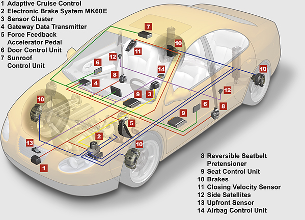

# Unidad 1 - Introducción a los Sistemas Embebidos

## Índice

- [1.1. Definición y Propiedades de los Sistemas Embebidos](#11-definición-y-propiedades-de-los-sistemas-embebidos)
- [1.2. Aplicaciones y diferencias entre Circuitos lógicos programables (CLP), microprocesadores y microcontroladores](#12-aplicaciones-y-diferencias-entre-circuitos-lógicos-programables-clp-microprocesadores-y-microcontroladores)
- [1.3. Introducción a la Arquitectura de microprocesadores](#13-introducción-a-la-arquitectura-de-microprocesadores)
- [1.4. Modelos de Arquitectura Harvard y Von Neumann](#14-modelos-de-arquitectura-harvard-y-von-neumann)
- [1.5. Tipos de set de instrucciones: RISC y CISC](#15-tipos-de-set-de-instrucciones-risc-y-cisc)
- [1.6. El concepto de Hardware Abstraction Layer](#16-el-concepto-de-hardware-abstraction-layer)
- [1.7. El concepto del lenguaje ensamblador](#17-el-concepto-del-lenguaje-ensamblador)
- [1.8. Proceso de compilación de lenguajes de alto nivel](#18-proceso-de-compilación-de-lenguajes-de-alto-nivel)
- [1.9. Introducción al lenguaje C/C++ para microcontroladores con programas tipo bare metal](#19-introducción-al-lenguaje-cc-para-microcontroladores-con-programas-tipo-bare-metal)
- [1.9. Introducción al lenguaje C/C++ Práctica 1]()
- [1.9. Introducción al lenguaje C/C++ Práctica 2]()
- [1.10. Algoritmos y ejercicios de programación tipo bare metal con el lenguaje C/C++ para microcontroladores](#110-algoritmos-y-ejercicios-de-programación-tipo-bare-metal-con-el-lenguaje-cc-para-microcontroladores)
- [1.10. Algoritmos y ejercicios Práctica 1]()
- [1.10. Algoritmos y ejercicios Práctica 2]()
- [1.10. Algoritmos y ejercicios Práctica 3]()

## 1.1. Definición y Propiedades de los Sistemas Embebidos

### Sistema Embebido

Es un dispositivo electrónico con capacidad de computación que está diseñado para cumplir una labor especifica en un producto. Comúnmente, un sistema embebido hace parte de un sistema más grande y complejo, por ejemplo vehículos (carros, motocicletas, aviones o naves espaciales), o incluso sistemas de la vida cotidiana, como lo son los electrodomésticos (lavadora, nevera o incluso la licuadora). 

El papel que desempeña un sistema embebido dentro del sistema mayor que lo contiene, comúnmente corresponde a la el control automático de todas o de una partede las funciones del sistema afitrión. Tales funciones pueden incluir el preprocesamiento de señales provenientes de sensores, control de actuadores y las comounicaciones inalámbricas. 

En las últimas décadas, la informática se ha convertido omnipresente en todo el mundo. Esta omnipresencia se puede palpar con la presencia de internet, la computación en la nube, los servidores globales, las computadoras portátiles, tabletas, teléfonos inteligentes y una inmensa varidad de dispositivos con capacidad de computación en todas partes [[1]](#referencias).

Figura 1. Sistema de control de abordo de un vehículo. [Fuente: aa1car.com](https://www.aa1car.com/library/bywire2.jpg)

Figura 2. ECU Automotriz [Fuente: autosoporte.com](https://autosoporte.com/conociendo-los-circuitos-de-procesamiento-de-datos-de-una-ecu/)

Figura 3. FMC de un Avion. [Fuente: Hispaviacion.es](https://www.hispaviacion.es/el-fms-2/#:~:text=El%20FMC%20o%20Flight%20Management,sistema%20de%20gesti%C3%B3n%20de%20vuelo.)

Figura 4. Sistema de abordo del satélite OPS-SAT de la Agencia Espacial Europea (ESA).  [Fuente: Telemadrid.es ](https://www.telemadrid.es/noticias/sociedad/La-Politecnica-desarrolla-un-software-para-mejorar-el-control-de-los-satelites-espaciales-0-2444755562--20220425070952.html)

### 1.1.1. Características de los sistemas embebidos

La principal característica de los sistemas embebidos es que emplean diversos tipos de procesadores digitales o dispositivos electrónicos capces de ejercer una función de procesamiento. A continuación, se presentan las principales características de los sistemas embebidos:

1. Tienen un nucleo, que es el encargado de procesar los datos y/o controlar el sistema para el cual fue diseñado. Este núcleo puede estar basado en diversas tecnologías de sistemas digitales tales como:
    - Microprocesador
    - Microcontrolador
    - Procesador de Señales Digitales (DSP, Digital Signal Processor)
    - CPLD
    - FPGA
    - Lógica TTL, CMOS o ECL
2. Cumplen una función específica en un sistema más grande.
3. Pueden incluir una interfaz Humano/Máquina, que permite la interacción con el sistema. 
4. Incluyen periféricos de alto nivel como sensores, actuadores, pantallas, dispositivos de audio, módulos de comunicación, entre otros. 
4. Sus funciones típicas son el monitoreo, el control y las comunicaciones. 
5. Son reprogramables o reconfigurables. 
6. Son flexibles, debido a que se pueden diseñar para aplicaciones específicas. Sin embargo, también pueden ser diseñados para aplicaciones de consumo masivo. 
7. Son de tamaño reducido. Existen algunos estándares que permiten determinar el tamaño de la placa de circuito impreso, pero esta va a depender en todos los casos de las características de la aplicación específica. 
8. Tienen bajo consumo de energía. 
9. Dependiendo del tipo de dispositivo de procesamiento, se peuden usar lenguajes de programación de software de alto nivel o lenguajes de descripción de hardware. 

## 1.2. Aplicaciones y diferencias entre Circuitos lógicos programables (PLDs), microprocesadores y microcontroladores

### **1.2.1 Definiciones**

**Circuitos integrados de aplicación específica (ASICs)**
Aplication-Specific Integrated Circuit (ASIC). 

Son circuitos electrónicos integrados en un solo chip que están diseñados para implementar una solución específica [[2]](#referencias).

Los ASICs son una gran categoría de dispositivos y se pueden clasificar como sigue:

- Dispositivos lógicos programables. 
- Matrices de compuertas. 
- Celda estándar. 
- Totalmente personalizados.

**Circuitos lógicos programables (PLDs)**

Son dispositivos electrónicos que pueden configurarse a la medida para *crear cualquier circuito digital deseado*, desde simples compuertas lógicas hasta sistemas digitales complejos [[2]](#referencias). 

Los PLDs se pueden clasificar según los siguientes tipos:

- Dispositivos lógicos programables simples (SPLDs)
- Dispositivos lógicos programables complejos (CPLDs). 
- Matrices de compuertas programables en campo (FPGAs).

Figura 5. CPLD Marca Altera. [Fuente: Wikipedia](https://es.wikipedia.org/wiki/CPLD#/media/Archivo:Altera_MAX_7128_2500_gate_CPLD.jpg).

Figura 6. FPGA. [Fuente: Mouser Electronics](https://co.mouser.com/new/xilinx/xilinx-virtex-ultrascale-vcu128-eval-kit/).

**Microprocesador**

El microprocesador es un circuito integrado que tiene la capacidad de realizar operaciones lógicas y matemáticas, ejecutar programas, procesar datos de entrada-salida, y controlar el funcionamiento de un sistema electónico [[3]](#referencias).. 

Sin embargo, para que el microprocesador realice sus funciones, es necesario conectarlo con más elementos, como memoria volátil, memoria no volátil (SSD o HHDD), circuitos de entrada/salida, reloj entre otros. 

Figura 7. Microprocesador. [Fuente: Wikipedia](https://es.wikipedia.org/wiki/Microprocesador#/media/Archivo:AMD_X2_3600.jpg).

**Microcontrolador**

Es un dispositivo electrónico que tiene la capacidad de realizar operaciones lógicas y matemáticas, ejecutar programas, procesar datos de entrada-salida, y controlar el funcionamiento de un sistema electónico [[3]](#referencias). 

A diferencia del *microprocesador*, el micrcontrolador ya incluye en un solo circuito integrado todos los elementos necesarios para ejecutar sus funciones: CPU, memoria, reloj oscilador y módulos I/O [[3]](#referencias).

Figura 8. Microcontrolador PIC 18F8720. [Fuente: Wikipedia](https://es.wikipedia.org/wiki/Microcontrolador#/media/Archivo:PIC18F8720.jpg)

**Sistema en un chip (SoC)**

El concepto de System-on-Chip (SoC), es *"simplemente"* un único circuito integrado que contiene cada uno de los elementos de una computadora. Sin embargo, los SoC no pueden acomodar suficiente memoria para un sistema operativo completo como Linux o Android y, por lo tanto, se debe proporcionar algo de memoria externa, a menudo además del propio SoC. [[1]](#referencias). Ejemplos de SoC bastante comerciales son: los ESP32 SoCs, ARM SoCs, Raspberry Pi SoCs, y otros. 

### **1.2.2. Aplicaciones de los sistemas Embebidos**

Las aplicaciones de los sistemas embebidos hoy en día se encuentran en muchos campos, tales son: 

- Equipos industriales de instrumentación y automatización.
- Aplicaciones militares.
- Equipos de comunicaciones.
- Bioingeniería y electromedicina.
- Vehículos para transporte terrestre, marítimo y aéreo.
- Vehículos y aplicaciones para el sector aerospacial.
- Dipositivos para el sector de consumo: electrodomésticos, juguetes, electrónica de consumo.
- Educación. 

El presente curso se enfocará en el estudio y diseño de sistemas embebidos basados en microcontrolador. Esto, debido a su gran felixibilidad, bajo costo y demanda en diversas aplicaciones como el Internet de las Cosas (IoT), la domótica y el Edge Computing. 

## 1.3. Introducción a la Arquitectura de microprocesadores

### **1.3.1. Arquitectura básica computacional**

Todo sistema de computación básico se compone de los siguientes elementos.
- Procesador o microcprocesador.
- Memoria no volátil.
- Memoria volátil.
- Bus de datos.
- Bus de control.
- Bus de direcciones.
- Interfaces:
    - Interfaz humano/máquina.
    - Interfaz de comunicación.
    - Interfaz de programación.
    - Interfaz de entrada/salida de propósito general. 

En la Figura 9 se puede apreciar un ejemplo de una arquitectura básica. Se ilustran tres ejemplos de interfaz para dispositivos de visualización o diferentes sensores/accionadores de datos, una interfaz de red (por ejemplo, Ethernet) y el control de un motor.

Figura 9. Arquitectura básica computacional. Fuente: [[1]](#referencias).

### ***1.3.2. Arquitectura de un microporcesador**

A continuación, se muestra la arquitectura básica de un microprocesador: 

Figura 10. Arquitectura básica de un Microprocesador. Fuente: [[3]](#referencias).

La CPU es la Unidad Central de Procesos y está formada por la Unidad de Control, Registros y la Unidad de Procesos [[3]](#referencias).

La memoria se divide en memoria de programa y memoria de datos, en donde se almacenan las instrucciones de programa y los datos respectivamente [[3]](#referencias).

Los módulos de entrada/salida permiten intercambiar información con el mundo exterior.
Se requiere de un clock (reloj del sistema) debidos que para funcionar, todo el dispositivo debe estar sincronizado, esto posibilita que todos los módulos interactúen entre sí [[3]](#referencias). Los tres bloques principales deben estar vinculados mediante buses de comunicación, (bus de datos, bus de direcciones y bus de control), por donde viajan los datos digitales [[3]](#referencias).

## 1.4. Modelos de Arquitectura Harvard y Von Neumann

### **1.4.1. Arquitectura Von Neumann**

En este modelo la unidad central de proceso o CPU está conectada a una memoria única que contiene las instrucciones del programa y los datos (ver Figuras 11 y 12).

Figura 11. Arquitectura Von Neumann, Simplificado. Fuente: [[4]](#referencias).

Figura 11. Arquitectura Von Neumann. Fuente: [[3]](#referencias).

El tamaño de la unidad de datos o instrucciones está fijado por el ancho del bus de datos de la memoria exterior utilizada. Por ejemplo, dado el caso de un microprocesador con un bus de 8 bits, deberá manejar datos e instrucciones de una o más unidades de 8 bits (1 byte) de longitud. Cuando deba acceder a una instrucción o dato de más de un byte de longitud, deberá realizar más de un acceso a la memoria. Por otro lado este bus único limita la velocidad de operación del microprocesador, ya que no se puede buscar en la memoria una nueva instrucción antes de que finalicen las transferencias de datos que pudieran resultar de la instrucción anterior [[4]](#referencias). 

### **1.4.2. Arquitectura Harvard**

La arquitectura Harvard dispone de dos memorias independientes a las que se conecta mediante dos grupos de buses separados (ver Figuras 13 y 14) [[4]](#referencias).

Figura 13. Arquitectura Harvard, Simplificado. Fuente: [[4]](#referencias).

Figura 14. Arquitectura Harvard. Fuente: [[3]](#referencias).

En la arquitectura Harvard los buses de datos y programa son totalmente independientes y pueden ser de distintos anchos. Esto permite que la CPU pueda acceder de forma independiente y simultánea a la memoria de datos y a la de instrucciones, consiguiendo que las instrucciones se ejecuten en menos ciclos de reloj [[4]](#referencias). 

### **

## 1.5. Tipos de set de instrucciones: RISC y CISC

1. CISC (Complex Instruction Set Computer). Son procesadores con un juego de instrucciones complejo. Su repertorio de instrucciones es elevado y algunas de ellas son muy sofisticadas y potentes. Su problema es que requieren de muchos ciclos de reloj para ejecutar las instrucciones complejas. 
2. RISC (Reduced Instruction Set Computer). Son microprocesadores con un repertorio de instrucciones reducido. Las instrucciones son muy simples y suelen ejecutarse en un ciclo máquina. Los procesadores RISC suelen tener una estructura Pipeline y ejecutar casi todas las instrucciones en el mismo tiempo.

## 1.6. El concepto de Hardware Abstraction Layer

## 1.7. El concepto del lenguaje ensamblador

## 1.8. Proceso de compilación de lenguajes de alto nivel

## 1.9. Introducción al lenguaje C/C++ para microcontroladores con programas tipo bare metal. 

## 1.9. Introducción al lenguaje C/C++ Práctica 1

## 1.9. Introducción al lenguaje C/C++ Práctica 2

## 1.10. Algoritmos y ejercicios de programación tipo bare metal con el lenguaje C/C++ para microcontroladores. 

## 1.10. Algoritmos y ejercicios Práctica 1

## 1.10. Algoritmos y ejercicios Práctica 2

## 1.10. Algoritmos y ejercicios Práctica 3

## Enlaces de interés

- [Índice general](/readme.md)
- [Bienvenida al curso](#bienvenida-al-curso-de-sistemas-embebidos-i)
- [Materiales](#materiales)

# Referencias

- [1] René Beuchat, Florian Depraz, Andrea Guerrieri, Sahand Kashani. *Fundamentals of System-on-Chip Design on Arm Cortex-M Microcontrollers*. ARM Educational Media. 2021.
- [2] TOCCI, RONALD J., NEAL S. WIDMER, GREGORY L. MOSS. *Sistemas digitales. Principios y aplicaciones*. Décima edición. Pearson Educación, México, 2007. ISBN: 978-970-26-0970-4. 
- [3] Jorge R. Osio, Walter J. Aróztegui, José A. Rapallini. Sistemas digitales basados en microcontroladores. Facultad de Ingeniería Universidad Nacional de la Plata. EDULP. 
- [4] Enrique Palacios Municio, Fernando Remiro Domínguez y Lucas J. López Pérez. *Microcontrolador PIC16f84. Desarrollo de Proyectos*. 3ª Edición. Editorial RA-MA. ISBN 978-84-9964-917-2. 2014.
- [5] 
- [6] 
- [7] 