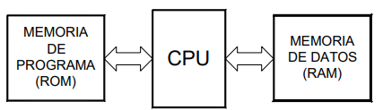

# Unidad 1 - Introducción a los Sistemas Embebidos

## Índice

- [1.1. Definición y Propiedades de los Sistemas Embebidos](#11-definición-y-propiedades-de-los-sistemas-embebidos)
- [1.2. Aplicaciones y diferencias entre Circuitos lógicos programables (CLP), microprocesadores y microcontroladores](#12-aplicaciones-y-diferencias-entre-circuitos-lógicos-programables-clp-microprocesadores-y-microcontroladores)
- [1.3. Introducción a la Arquitectura de microprocesadores](#13-introducción-a-la-arquitectura-de-microprocesadores)
- [1.4. Modelos de Arquitectura Harvard y Von Neumann](#14-modelos-de-arquitectura-harvard-y-von-neumann)
- [1.5. Tipos de set de instrucciones: RISC y CISC](#15-tipos-de-set-de-instrucciones-risc-y-cisc)
- [1.6. El concepto de Hardware Abstraction Layer](#16-el-concepto-de-hardware-abstraction-layer)
- [1.7. El concepto del lenguaje ensamblador](#17-el-concepto-del-lenguaje-ensamblador)
- [1.8. Proceso de compilación de lenguajes de alto nivel](#18-proceso-de-compilación-de-lenguajes-de-alto-nivel)
- [1.9. Introducción al lenguaje C/C++](#19-introducción-al-lenguaje-cc)
- [1.9. Introducción al lenguaje C/C++ Práctica 1](#191-introducción-al-lenguaje-cc-práctica-1)
- [1.9. Introducción al lenguaje C/C++ Práctica 2](#192-introducción-al-lenguaje-cc-práctica-2)
- [1.10. Algoritmos y ejercicios de programación tipo bare metal con el lenguaje C/C++ para microcontroladores](#110-algoritmos-y-ejercicios-de-programación)
- [1.10. Algoritmos y ejercicios Práctica 1](#1101-algoritmos-y-ejercicios-práctica-1)
- [1.10. Algoritmos y ejercicios Práctica 2](#1102-algoritmos-y-ejercicios-práctica-2)
- [1.10. Algoritmos y ejercicios Práctica 3](#1103-algoritmos-y-ejercicios-práctica-3)
- [Referencias](#referencias)

## 1.1. Definición y Propiedades de los Sistemas Embebidos

### Sistema Embebido

Es un dispositivo electrónico con capacidad de computación que está diseñado para cumplir una labor especifica en un producto. Comúnmente, un sistema embebido hace parte de un sistema más grande y complejo, por ejemplo vehículos (carros, motocicletas, aviones o naves espaciales), o incluso sistemas de la vida cotidiana, como lo son los electrodomésticos (lavadora, nevera o incluso la licuadora). 

El papel que desempeña un sistema embebido dentro del sistema mayor que lo contiene, comúnmente corresponde a la el control automático de todas o de una partede las funciones del sistema afitrión. Tales funciones pueden incluir el preprocesamiento de señales provenientes de sensores, control de actuadores y las comounicaciones inalámbricas. 

En las últimas décadas, la informática se ha convertido omnipresente en todo el mundo. Esta omnipresencia se puede palpar con la presencia de internet, la computación en la nube, los servidores globales, las computadoras portátiles, tabletas, teléfonos inteligentes y una inmensa varidad de dispositivos con capacidad de computación en todas partes [[1]](#referencias).

*Figura 1. Sistema de control de abordo de un vehículo. [Fuente: aa1car.com](https://www.aa1car.com/library/bywire2.jpg)*

*Figura 2. ECU Automotriz [Fuente: autosoporte.com](https://autosoporte.com/conociendo-los-circuitos-de-procesamiento-de-datos-de-una-ecu/)*

*Figura 3. FMC de un Avion. [Fuente: Hispaviacion.es](https://www.hispaviacion.es/el-fms-2/#:~:text=El%20FMC%20o%20Flight%20Management,sistema%20de%20gesti%C3%B3n%20de%20vuelo.)*

*Figura 4. Sistema de a bordo del satélite OPS-SAT de la Agencia Espacial Europea (ESA).  [Fuente: Telemadrid.es ](https://www.telemadrid.es/noticias/sociedad/La-Politecnica-desarrolla-un-software-para-mejorar-el-control-de-los-satelites-espaciales-0-2444755562--20220425070952.html)*

### 1.1.1. Características de los sistemas embebidos

La principal característica de los sistemas embebidos es que emplean diversos tipos de procesadores digitales o dispositivos electrónicos capces de ejercer una función de procesamiento. A continuación, se presentan las principales características de los sistemas embebidos:

1. Tienen un nucleo, que es el encargado de procesar los datos y/o controlar el sistema para el cual fue diseñado. Este núcleo puede estar basado en diversas tecnologías de sistemas digitales tales como:
    - Microprocesador
    - Microcontrolador
    - Procesador de Señales Digitales (DSP, Digital Signal Processor)
    - CPLD
    - FPGA
    - Lógica TTL, CMOS o ECL
2. Cumplen una función específica en un sistema más grande.
3. Pueden incluir una interfaz Humano/Máquina, que permite la interacción con el sistema. 
4. Incluyen periféricos de alto nivel como sensores, actuadores, pantallas, dispositivos de audio, módulos de comunicación, entre otros. 
4. Sus funciones típicas son el monitoreo, el control y las comunicaciones. 
5. Son reprogramables o reconfigurables. 
6. Son flexibles, debido a que se pueden diseñar para aplicaciones específicas. Sin embargo, también pueden ser diseñados para aplicaciones de consumo masivo. 
7. Son de tamaño reducido. Existen algunos estándares que permiten determinar el tamaño de la placa de circuito impreso, pero esta va a depender en todos los casos de las características de la aplicación específica. 
8. Tienen bajo consumo de energía. 
9. Dependiendo del tipo de dispositivo de procesamiento, se peuden usar lenguajes de programación de software de alto nivel o lenguajes de descripción de hardware. 

## 1.2. Aplicaciones y diferencias entre Circuitos lógicos programables (PLDs), microprocesadores y microcontroladores

### **1.2.1 Definiciones**

**Circuitos integrados de aplicación específica (ASICs)**
Aplication-Specific Integrated Circuit (ASIC). 

Son circuitos electrónicos integrados en un solo chip que están diseñados para implementar una solución específica [[2]](#referencias).

Los ASICs son una gran categoría de dispositivos y se pueden clasificar como sigue:

- Dispositivos lógicos programables. 
- Matrices de compuertas. 
- Celda estándar. 
- Totalmente personalizados.

**Circuitos lógicos programables (PLDs)**

Son dispositivos electrónicos que pueden configurarse a la medida para *crear cualquier circuito digital deseado*, desde simples compuertas lógicas hasta sistemas digitales complejos [[2]](#referencias). 

Los PLDs se pueden clasificar según los siguientes tipos:

- Dispositivos lógicos programables simples (SPLDs)
- Dispositivos lógicos programables complejos (CPLDs). 
- Matrices de compuertas programables en campo (FPGAs).

*Figura 5. CPLD Marca Altera. [Fuente: Wikipedia](https://es.wikipedia.org/wiki/CPLD#/media/Archivo:Altera_MAX_7128_2500_gate_CPLD.jpg).*

*Figura 6. FPGA. [Fuente: Mouser Electronics](https://co.mouser.com/new/xilinx/xilinx-virtex-ultrascale-vcu128-eval-kit/).*

**Microprocesador**

El microprocesador es un circuito integrado que tiene la capacidad de realizar operaciones lógicas y matemáticas, ejecutar programas, procesar datos de entrada-salida, y controlar el funcionamiento de un sistema electónico [[3]](#referencias).. 

Sin embargo, para que el microprocesador realice sus funciones, es necesario conectarlo con más elementos, como memoria volátil, memoria no volátil (SSD o HHDD), circuitos de entrada/salida, reloj entre otros. 

*Figura 7. Microprocesador. [Fuente: Wikipedia](https://es.wikipedia.org/wiki/Microprocesador#/media/Archivo:AMD_X2_3600.jpg).*

**Microcontrolador**

Es un dispositivo electrónico que tiene la capacidad de realizar operaciones lógicas y matemáticas, ejecutar programas, procesar datos de entrada-salida, y controlar el funcionamiento de un sistema electónico [[3]](#referencias). 

A diferencia del *microprocesador*, el micrcontrolador ya incluye en un solo circuito integrado todos los elementos necesarios para ejecutar sus funciones: CPU, memoria, reloj oscilador y módulos I/O [[3]](#referencias).

*Figura 8. Microcontrolador PIC 18F8720. [Fuente: Wikipedia](https://es.wikipedia.org/wiki/Microcontrolador#/media/Archivo:PIC18F8720.jpg)*

**Sistema en un chip (SoC)**

El concepto de System-on-Chip (SoC), es *"simplemente"* un único circuito integrado que contiene cada uno de los elementos de una computadora. Sin embargo, los SoC no pueden acomodar suficiente memoria para un sistema operativo completo como Linux o Android y, por lo tanto, se debe proporcionar algo de memoria externa, a menudo además del propio SoC. [[1]](#referencias). Ejemplos de SoC bastante comerciales son: los ESP32 SoCs, ARM SoCs, Raspberry Pi SoCs, y otros. 

### **1.2.2. Aplicaciones de los sistemas Embebidos**

Las aplicaciones de los sistemas embebidos hoy en día se encuentran en muchos campos, tales son: 

- Equipos industriales de instrumentación y automatización.
- Aplicaciones militares.
- Equipos de comunicaciones.
- Bioingeniería y electromedicina.
- Vehículos para transporte terrestre, marítimo y aéreo.
- Vehículos y aplicaciones para el sector aerospacial.
- Dipositivos para el sector de consumo: electrodomésticos, juguetes, electrónica de consumo.
- Educación. 

El presente curso se enfocará en el estudio y diseño de sistemas embebidos basados en microcontrolador. Esto, debido a su gran felixibilidad, bajo costo y demanda en diversas aplicaciones como el Internet de las Cosas (IoT), la domótica y el Edge Computing. 

## 1.3. Introducción a la Arquitectura de microprocesadores

### **1.3.1. Arquitectura básica computacional**

Todo sistema de computación básico se compone de los siguientes elementos.
- Procesador o microcprocesador.
- Memoria no volátil.
- Memoria volátil.
- Bus de datos.
- Bus de control.
- Bus de direcciones.
- Interfaces:
    - Interfaz humano/máquina.
    - Interfaz de comunicación.
    - Interfaz de programación.
    - Interfaz de entrada/salida de propósito general. 

En la Figura 9 se puede apreciar un ejemplo de una arquitectura básica. Se ilustran tres ejemplos de interfaz para dispositivos de visualización o diferentes sensores/accionadores de datos, una interfaz de red (por ejemplo, Ethernet) y el control de un motor.

*Figura 9. Arquitectura básica computacional. Fuente: [[1]](#referencias).*

### **1.3.2. Arquitectura de un microporcesador**

A continuación, se muestra la arquitectura básica de un microprocesador: 

*Figura 10. Arquitectura básica de un Microprocesador. Fuente: [[3]](#referencias).*

La CPU es la Unidad Central de Procesos y está formada por la Unidad de Control, Registros y la Unidad de Procesos [[3]](#referencias).

La memoria se divide en memoria de programa y memoria de datos, en donde se almacenan las instrucciones de programa y los datos respectivamente [[3]](#referencias).

Los módulos de entrada/salida permiten intercambiar información con el mundo exterior.
Se requiere de un clock (reloj del sistema) debidos que para funcionar, todo el dispositivo debe estar sincronizado, esto posibilita que todos los módulos interactúen entre sí [[3]](#referencias). Los tres bloques principales deben estar vinculados mediante buses de comunicación, (bus de datos, bus de direcciones y bus de control), por donde viajan los datos digitales [[3]](#referencias).

## 1.4. Modelos de Arquitectura Harvard y Von Neumann

### **1.4.1. Arquitectura Von Neumann**

En este modelo la unidad central de proceso o CPU está conectada a una memoria única que contiene las instrucciones del programa y los datos (ver Figuras 11 y 12).

*Figura 11. Arquitectura Von Neumann, Simplificado. Fuente: [[4]](#referencias).*

*Figura 11. Arquitectura Von Neumann. Fuente: [[3]](#referencias).*

El tamaño de la unidad de datos o instrucciones está fijado por el ancho del bus de datos de la memoria exterior utilizada. Por ejemplo, dado el caso de un microprocesador con un bus de 8 bits, deberá manejar datos e instrucciones de una o más unidades de 8 bits (1 byte) de longitud. Cuando deba acceder a una instrucción o dato de más de un byte de longitud, deberá realizar más de un acceso a la memoria. Por otro lado este bus único limita la velocidad de operación del microprocesador, ya que no se puede buscar en la memoria una nueva instrucción antes de que finalicen las transferencias de datos que pudieran resultar de la instrucción anterior [[4]](#referencias). 

### **1.4.2. Arquitectura Harvard**

La arquitectura Harvard dispone de dos memorias independientes a las que se conecta mediante dos grupos de buses separados (ver Figuras 13 y 14) [[4]](#referencias).

*Figura 13. Arquitectura Harvard, Simplificado. Fuente: [[4]](#referencias)*.

*Figura 14. Arquitectura Harvard. Fuente: [Fuente: [3]](#referencias)*.

En la arquitectura Harvard los buses de datos y programa son totalmente independientes y pueden ser de distintos anchos. Esto permite que la CPU pueda acceder de forma independiente y simultánea a la memoria de datos y a la de instrucciones, consiguiendo que las instrucciones se ejecuten en menos ciclos de reloj [[4]](#referencias). 

## 1.5. Tipos de set de instrucciones: RISC y CISC

**¿Qué es un set de insturcciones?**

El *instruction set architecture* o en españo set de instrucciones de la arquitectura es una especificación que define las instrucciones que "reconoce" y es capaz de ejecutar un microprocesador específico. Cada microprocesador, según su fabricante y según su arquitectura, tiene distintos tipos de instrucciones. Incluso, microprocesadores de las mismas familias pueden contener distintos sets de instrucciones. Estos sets de instrucciones, a menudo, especifican lo siguiente:
- Las instrucciones.
- Los registros especiales y de propósito general
- Tipos de datos o rangos de los registros.
- La arquitectura de memoria.
- Las interrupciones.

1. CISC (Complex Instruction Set Computer). Son procesadores con un juego de instrucciones complejo. Su repertorio de instrucciones es elevado y algunas de ellas son muy sofisticadas y potentes. Su problema es que requieren de muchos ciclos de reloj para ejecutar las instrucciones complejas [[4]](#referencias). Un ejemplo de este set de instrucciones es el de la arquitectura x86 [La cual puede consultar en este link de referencia](https://learn.microsoft.com/en-us/windows-hardware/drivers/debugger/x86-architecture)
2. RISC (Reduced Instruction Set Computer). Son microprocesadores con un repertorio de instrucciones reducido. Las instrucciones son muy simples y suelen ejecutarse en un ciclo máquina. Los procesadores RISC suelen tener una estructura Pipeline y ejecutar casi todas las instrucciones en el mismo tiempo [[4]](#referencias). En las Figuras 15 y 16 se pueden ver ejemplos de set de instrucciones reducidos.
3. SISC (Specific Instruction Set Computer). Estos procesadores poseen un juego de instrucciones específico para cada aplicación. Están destinados a aplicaciones muy concretas [[4]](#referencias). En la Figura 17 se puede ver parte del set de instrucciones del CPU TMS320C28x, de Texas Instrument.

*Figura 15. Set de instrucciones de un PIC16F84A. [Fuente: Microchip](https://ww1.microchip.com/downloads/en/devicedoc/35007b.pdf)*

*Figura 16. Set de instrucciones de los ARM Cortex M0, Cortex M3 y Cortex M4. [Fuente: [5]](#referencias)*

*Figura 17. Set de instrucciones del CPU TMS320C28x, de Texas Instrument. [Fuente: Texas Instrument](https://www.ti.com/lit/ug/spru430f/spru430f.pdf?ts=1690959208588&ref_url=https%253A%252F%252Fwww.google.com%252F)*

Los microprocesadores basados en arquitecturas SISC o RISC no han logrado mayor popularidad para emplearse en los ordenadores personales. Por el contrario, ha predominado los CISC, debido al aumento constante en la capacidad de procesamiento de estos. Es así que, el uso de microprocesadores basados en RISC y SISC se siguen limitado a necesidades muy específicas de procesamiento, como en los procesadores DSP.

## 1.6. El concepto de Hardware Abstraction Layer

Uno de los problemas más básicos al desarrollar software para un sistem-on_chip (SoC) está relacionado con la portabilidad del código. Esto último se refiere a la capacidad de un software para ejecutarse en distintas plataformas, en este caso, SoCs diferentes (o de distintos fabricantes). Esta es una cuestión fundamental para cualquier organización que desee invertir en el desarrollo de un sistema operativo (OS, *operating system*), que probablemente solo tenga alguna posibilidad comercial si puede ejecutarse en varias plataformas SoC, sin un esfuerzo y un gasto de desarrollo significativos. En tal escenario, el objetivo es hacer que el OS sea lo más abstracto posible con respecto al hardware subyacente. Para ello, los fabricantes de SoCs, desarrollan la "Capa de Abstracción de Hardware (*HAL, Hardware Abstraction Layer*), que consiste en un programa que implementa una serie de métodos (funciones, clases, estructuras, etc.) que permiten la virtualización del entorno de ejecución, lo que permite que un sistema operativo sea compatible con múltiples plataformas de SoC [[1]](#referencias).

De acuerdo con lo anterior, es posible decir el concepto de capa de abstracción de hardware o HAL, es un software que define e implementa todas las funciones requeridas para acceder al hardware de un microprocesador/microcontrolador o conjunto de ellos, típicamente del mismo fabricante. La HAL proporciona funciones de alto nivel al programador, de manera que éste no se preocupa por cómo debe acceder a memoria o los periféricos del hardware, sino que le proporciona una *interfaz* para que lo pueda hacer. 

No hay que confundir el concepto de HAL con el de kernel de un OS. El kernel por su parte, abstrae la administración de la CPU o *scheduling*, realiza la asignación de memoria, el sistema de archivos, entre otras funciones, que es lo mismo en diferentes tipos de CPU y hardware. Por otro lado, una HAL encapsula la lógica del controlador de diferentes CPU y hardware.

A continuación, se muestran las capas en las que se puede dividir un sistema embebido. Típicamente, todas las capas ya están dadas, y el usuario o programador hace uso de todas ellas en la capa de aplicación. 

*Figura 18. Capas de un sistema embebido. Fuente: Elaboración propia.*

## 1.7. El concepto del lenguaje ensamblador

Antes de definir el lenguaje ensamblador, debemos definir qué es el lenguaje máquina, ya que ambos están estrechamente relacionados. Pero mucho antes, debemos recordar qué es un lenguaje.

### **¿Qué es un lenguaje?**

La definición de lenguaje puede variar dependiendo del contexto en que se analice. Por lo tanto, se tratará de ser lo más superior posible en cuanto a esta definición. Así pues, se definirá lenguaje como un conjunto limitado o código de signos, con reglas de sintaxis y estructuras definidas, cuyo objetivo es permitir una comunicación efectiva entre dos o más entes o sujetos. 

Los lenguajes pueden abarcar distintos tipos de signos, tales como, visuales (gráficos, luces, gestos, etc.), auditivos o táctiles u otros relacionados con los sentidos o el pensamiento. De este modo, los lenguajes se pueden clasificar en: humano, animal y formal. Éste último es el que nos ocupará.

Por lo tanto, para efectos de ubicar el concepto de lenguaje en el contexto de los sistemas embebidos, se considerará que lenguaje es una construcción artificial humana que se usan en matemáticas y otras disciplinas formales, incluyendo la informática.

### **Lenguaje maquina:** 

También llamado código máquina. Es el sistema de codificación o lenguaje (si se quiere) que es directamente ejecutado por un microprocesador; de ahí viene la denominación "lenguaje máquina". Su composición se basa en los estados eléctricos de “encendido o apagado”, lo que en términos binarios se conoce como “unos y ceros”. Cualquier instrucción que deba ser ejecutada por el microprocesador debe estar expresada en binario.

### **Lenguaje ensamblador:** 

(Assembly languaje o assembler, del inglés), Es un lenguaje de programación de bajo nivel, que se usa para la programación de microprocesadores. Es un lenguaje muy cercano al código máquina, ya que cada instrucción se corresponde con un código máquina directamente (casi). 

Este lenguaje está basado en “mnemónicos” ya que sustituye una instrucción en código máquina por palabras o símbolos alfanuméricos más fáciles de recordar por el programador.

*Figura 19. Ejemplo de código máquina. [Fuente: Wikipedia](https://es.wikipedia.org/wiki/Lenguaje_de_m%C3%A1quina#/media/Archivo:Codigo_de_maquina.png)*

Lenguaje de máquina del Intel 8088. El código de máquina en hexadecimal en rojo, el equivalente en lenguaje ensamblador en magenta, y las direcciones de memoria donde se encuentra el código, en azul. Abajo se ve un texto en hexadecimal y ASCII [Fuente: Wikipedia](https://es.wikipedia.org/wiki/Lenguaje_de_m%C3%A1quina#/media/Archivo:Codigo_de_maquina.png).

Un programa escrito en Assembler típicamente tiene la extensión *.asm o *.s. Éste programa se denomina código fuente y es dependiente de la arquitectura de microprocesador que se esté usando.
Algunas de las arquitecturas comunes en microprocesadores son:
- X86-64
- ARM
- PowerPC
- DEC Alpha
- MIPS
- PA-RISC

### **El programa ensamblador**

Es un software que se encarga de traducir el lenguaje ensamblador a lenguaje máquina. "Traduce" los **mnemónicos** y los convierte en *“opcode”* (código de operación). El Opcode saliente varía según el conjunto de instrucciones del microprocesador. Las operaciones pueden ser: aritméticas, lógicas, escritura o lectura de memoria y control del programa.

## 1.8. Proceso de compilación de lenguajes de alto nivel

**Compilar:** es el proceso de transformar un programa informático escrito en un lenguaje (llamado código fuente) en un conjunto de instrucciones en otro formato o lenguaje (llamado código objeto).

El resultado final de la compilación serán los archivos en código binario o "ejecutables" que serán cargados en la memoria de programa del microprocesador y que éste podrá ejecutar. 

De manera general, el proceso de compilación que se lleva a cabo como sigue:

- Preprocesamiento (Preprocesador) 
    - Análisis léxico: bien escrito
    - Análisis sintáctico: coherencia
    - Análisis semántico: verificación de tipos de datos
- Compilación (Compilador)
    - Generación de código intermedio
    - Optimización de código

- Ensamble (Ensamblador)
    - Generación de código máquina

- Enlazado (Linker)
    - Genara coherencia y cohesión en las instrucciones.
    - Generación de ejecutables.

A continuación, se muestra un diagrama del proceso y sus archivos producto. 

*Figura 20. Diagrama de componentes (UML) del proceso de compilación. Fuente: Elaboración propia.*

 *Nota terminológica*. Al programa o software escrito para dispositivos electrónicos (como microprocesadores o microcontroladores) se le denomina *firmware*.

## 1.9. Introducción al lenguaje C/C++

El lenguaje de programación C o simplemente lenguaje C, es un lenguaje de programación desarrollado en 1972 por Dennis Ritchie y Brian Kernighan. Ambos escribieron el libro denominado *"The C Programming Language"* o en español *"El lenguaje de programación C"* [6](#referencias), el cual es el estandar de C persé. 

  

### [1.9.1. Introducción al lenguaje C/C++ Práctica 1](1.9_Practica1.md)

### [1.9.2. Introducción al lenguaje C/C++ Práctica 2](1.9_Practica2.md)

## 1.10. Algoritmos y ejercicios de programación

Para el desarrollo del curso se hará uso del lenguaje C, a través del uso del *toolchain* de la empresa ESPRESSIF, denominado ESP-IDF. Toda la información y documentación sobre esta herramienta la puede encontrar en la [página oficial de ESPRESSIF](https://docs.espressif.com/projects/esp-idf/en/latest/esp32/get-started/windows-setup.html). 

Para facilitar el proceso de enseñanza aprendizaje se hará uso de entorno de desarrollo Visual Studio Code, con la extensión PlatformIO. Por favor revise la [guía de instalación de las herramientas del curso](1.9_guia_instal_tools.md).

### [1.10.1. Algoritmos y ejercicios Práctica 1](1.10_Practica1.md)

### [1.10.2 Algoritmos y ejercicios Práctica 2](1.10_Practica2.md)

### [1.10.3 Algoritmos y ejercicios Práctica 3](1.10_Practica3.md)

## Enlaces de interés

- [Ir al principio de este documento (Unidad 1)](#índice)
- [Índice general del curso](/readme.md)
- [guía de instalación de las herramientas del curso](1.9_guia_instal_tools.md)
- [Unidad 2](/Unidad_2/readme.md)
- [Unidad 3](/Unidad_3/readme.md)

# Referencias

- [1] René Beuchat, Florian Depraz, Andrea Guerrieri, Sahand Kashani. *Fundamentals of System-on-Chip Design on Arm Cortex-M Microcontrollers*. ARM Educational Media. 2021.
- [2] TOCCI, RONALD J., NEAL S. WIDMER, GREGORY L. MOSS. *Sistemas digitales. Principios y aplicaciones*. Décima edición. Pearson Educación, México, 2007. ISBN: 978-970-26-0970-4. 
- [3] Jorge R. Osio, Walter J. Aróztegui, José A. Rapallini. Sistemas digitales basados en microcontroladores. Facultad de Ingeniería Universidad Nacional de la Plata. EDULP. 
- [4] Enrique Palacios Municio, Fernando Remiro Domínguez y Lucas J. López Pérez. *Microcontrolador PIC16f84. Desarrollo de Proyectos*. 3ª Edición. Editorial RA-MA. ISBN 978-84-9964-917-2. 2014.
- [5] ARIEL LUTENBERG, PABLO GOMEZ, ERIC PERNIA. *A Beginner’s Guide to Designing Embedded System Applications on Arm® Cortex®-M Microcontrollers*. ARM Education Media. ISBN: 978-1-911531-42-5 (ePDF)
- [6] BRIAN W. KERNIGHAN y DENNIS M. RITCHIE. *El lenguaje de programación C*. 2da Edición. Pearson Education. 1991. Prentice-Hall Hispanoamericana. 
