# Unidad 2 - Programación básica de Microcontroladores.

## Índice

- [2.1. Uso del periférico UART.](#21-uso-del-periférico-uart)
- [2.2. Integración de sensores analógicos.](#22-integración-de-sensores-analógicos)
- [2.3. Integración de sensores digitales.](#23-integración-de-sensores-digitales)
- [2.4. Integración de diversos dispositivos de entrada/salida.](#integración-de-diversos-dispositivos-de-entradasalida)
- [2.5. Manejo del tiempo.](#25-manejo-del-tiempo)
- [2.6. Integración con visualizadores.](#26-integración-con-visualizadores)
- [2.7. Integración con actuadores de control On-Off.](#27-integración-con-actuadores-de-control-on-off)
- [2.8. Integración con actuadores de control continuo.](#28-integración-con-actuadores-de-control-continuo)

## 2.1. Uso del periférico UART

Las siglas UART traducen: Universal Asynchronous Receiver/Transmitter (Transmisor/Receptor Asíncrono Universal). Este es un protocolo de comunicación serie entre dos dispositivos. Un ejemplo del uso de este protocolo es en la comunicación con interfaz RS-232. El protocolo UART utiliza dos líneas entre el transmisor y receptor para transmitir y recibir en ambas direcciones. La conexión se realiza de forma cruzada. Es decir, la línea de transmisión del primer dispositivo se conecta a la línea de transmisión del segundo y viceversa. La comunicación en el UART puede ser simplex, semidúplex, o full-dúplex. A continuación, se presenta un diagrama de conexión UART entre dos dispositivos:


*Figura 1. Conexión UART.*

### Es serie

Los datos en el protocolo UART se transmiten uno tras otro en el mismo canal (por eso es serie) en forma de tramas de bits. El formato y el contenido de estas tramas se describe y explica brevemente.

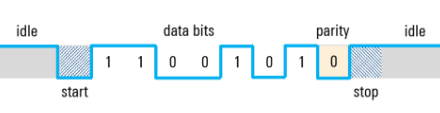

*Figura 2. Formato de Trama UART.*

El protocolo UART no define voltajes o rangos de voltaje específicos para los niveles lógicos de transmisión 0 o 1 (bajo o alto), esto va a depender específicamente de los fabricantes de chips. Por lo tanto, algunos autores llaman al nivel a alto como “marca” mientras que al nivel bajo lo llaman “espacio”. Mientras no se están trasmitiendo datos, la línea de transmisión se mantiene en estado alto, este estado también se le conoce como “estado Idle”. 

### Bits de start y stop

Ya que el UART es asíncrono, el transmisor necesita indicar que los bits de datos están llegando. Esto se logra utilizando el bit de inicio. El bit de inicio es una transición del estado alto de reposo a un estado bajo, y seguido inmediatamente por bits de datos de usuario.

Después de que se terminan los bits de datos, el bit de parada indica el fin de datos de usuario. El bit de parada es una transición de regreso al estado alto o Idle o permanece en el estado alto por un tiempo de bit adicional. Se puede configurar un segundo bit de parada (opcional), generalmente para darle tiempo al receptor de prepararse para la siguiente trama, pero esto no es común en la práctica.

### Bits de datos

Los bits de datos son los datos de usuario o bits “útiles” y vienen inmediatamente después del bit de inicio. Puede haber de 5 a 9 bits de datos de usuario, aunque de 7 o 8 bits es lo más común. Estos bits de datos normalmente se transmiten primero con el bit menos importante.

### Bit de paridad

Una trama UART puede también contener un bit de paridad opcional que puede usarse para la detección de errores. Este bit se inserta entre el final de los bits de datos y el bit de parada. El valor del bit de paridad depende del tipo de paridad que esta siendo usado (par o impar):
En la paridad par, este bit se configura para que el total de números 1 en la trama será par.
En la paridad impar, este bit se configura para que el total de números 1 en la trama será impar

### Es asíncrono

El protocolo UART es asíncrono. Es decir, el transmisor y el receptor no comparten una señal de reloj. Esto ayuda a simplificar el protocolo, sin embargo, por esta misma razón el transmisor y el receptor deben “comprometerse” a transmitir a la misma velocidad, tener el mismo tamaño de trama y tener las mismas reglas de paridad para que la comunicación sea. Las velocidades de baudios del UART más comunes que se utilizan en estos días son 4800, 9600, 19.2K, 57.6K y 115.2K. 

### [Práctica 2.1. UART](2.1_practica_2_1_UART.md)

## 2.2. Integración de sensores analógicos

### Procesamiento digital de señales

El procesamiento digital de la señal convierte señales de naturaleza analógica, tales como el sonido, el vídeo e información procedente de sensores, en formato digital, utilizando técnicas digitales para mejorar y modificar los datos de las señales analógicas para distintas aplicaciones [[2]](#referencias).

Debido a que los dispositivos basados en tecnología digital como lo son los Microcontroladores, no tienen compatibilidad directa con electrónica analógica, es necesaria la implementación de circuitos intermedios que permitan acoplar los distintos niveles de tención y señales continuas con las discretas. 

**Ejemplo:**

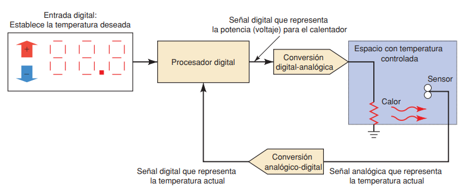

*Figura 3. Diagrama de bloques de un sistema digital para control de temperatura [Tomado de: [1]](#referencias).*

Un sistema de procesamiento digital de señal tiene las siguietnes etapas básicas: 

- Traduce primero una señal analógica que varía de manera continua a una serie de niveles discretos. Donde se modifica la señal analógica para obtener una aproximación de la misma en formato de "escalera". Este proceso se realiza mediante un circuito de muestreo y retención [[2]](#referencias).
  
  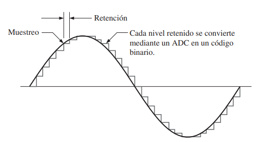
  
    *Figura 4. Señal senoidal con aproximación de escalera [Tomado de: [2]](#referencias).*

- Luego viene el proceso de cuantificación, que busca obtener una serie de códigos binarios que representan cada uno de los pasos discretos de esa aproximación, mediante un proceso denominado conversión analógico-digital (A/D). El circuito que realiza la conversión A/D se denomina convertidor analógico-digital (ADC, Analog-to-Digital Converter) [[2]](#referencias).
  
  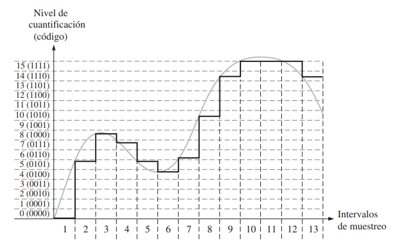
  
    *Figura 5. Muestreo, retención y cuantificación de una onda senoidal [Tomado de: [2]](#referencias).*

- Luego de la conversión analógico-digital, se la aplica a un procesador digital de la señal (DSP, Digital Signal Proccesor). El DSP puede realizar diversas operaciones con los datos entrantes, como por ejemplo eliminar las interferencias no deseadas, aumentar la amplitud de ciertas frecuencias de la señal y reducir la de otras, codificar los datos para realizar una transmisión segura de los mismos y detectar y corregir errores en los códigos transmitidos [[2]](#referencias). 

- Luego de este procesamiento digital, la señal debe convertirse nuevamente en analógica. Este paso se lleva a cabo mediante un convertidor digital-analógico (DAC, Digital-to-Analog Converter). 

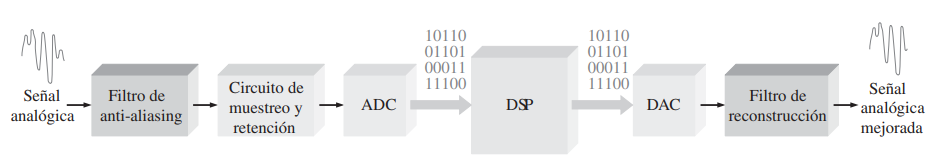

*Figura 6. Diagrama de bloques de un sistema básico de procesamiento digital de señales [Tomado de: [2]](#referencias).*

### Conversión analógica-digital

Es el proceso por el que una magnitud analógica se convierte a formato digital. Los circuitos electrónicos que realizan esta labor, son llamados *Convertidores analógicos a digital (ADC, del inglés analog-to-digital converter)*. 

Existen dos parámetros importantes para los ADC:

- Resolución: el número de bits de la conversión.  
- Tasa de transferencia: la frecuencia de muestreo que un ADC puede aceptar, en número de muestras por segundo.

Existen diferentes tipos de circuitos capaces de realizar la conversión analógica-digital:

- Convertidor analógico-digital por aproximaciones sucesivas *(SAR, Successive Approximation Register)*.
- Convertidor analógico-digital sigma-delta (S-D).
- Convertidor analógico-digital flash
- Convertidor analógico-digital de pendiente doble

Si desea saber más a cerca de estos convertidores, puede consultar el libro de Thomas L. Floyd. FUNDAMENTOS DE SISTEMAS DIGITALES [[2]](#referencias), en la sección *13.3 MÉTODOS DE CONVERSIÓN ANALÓGICA-DIGITAL*.

### ADC en el ESP32

El chip ESP32 integra dos convertidores analógico-digital por aproximaciones sucesivas *(SAR)* de 12 bits (2^12 valores enteros, de 0 a 4095) y admite dos canales ADC [[3]](#referencias):

- ADC1, con 8 pines, conectados a los GPIO 32 - 39 [[3]](#referencias).
- ADC2, con 10 pines, conectados a los GPIO 0, 2, 4, 12 - 15 y 25 - 27, con las siguientes restricciones para crear aplicaciones [[3]](#referencias):
  - El ADC2 es utilizado por el controlador Wi-Fi. Por lo tanto, la aplicación solo puede usar ADC2 cuando el controlador Wi-Fi no se ha iniciado [[3]](#referencias).
  - Algunos de los pines ADC2 se usan como (strapping pins) (GPIO 0, 2, 15), por lo tanto, no se pueden usar libremente. Tal es el caso en los siguientes Kits oficiales de desarrollo:
    - ESP32 DevKitC: GPIO 0 no se puede usar debido a circuitos externos de programas automáticos [[3]](#referencias).
    - ESP-WROVER-KIT: GPIO 0, 2, 4 y 15 no se pueden usar debido a conexiones externas para diferentes propósitos [[3]](#referencias).

### Configuración y lectura ADC en el ESP32 con ESO-IDF

Cada unidad ADC admite dos modos de trabajo, ADC-RTC o modo ADC-DMA. 

- ADC-RTC muestreo de baja frecuencia [[3]](#referencias).
- ADC-DMA muestreo continuo de alta frecuencia [[3]](#referencias).

El ADC debe configurarse antes de tomar la lectura. Para hacer uso de las funciones del ADC con el framwork ESP-IDF, es necesario incluir la biblioteca 

```
#include "driver/adc.h"
```

**Para ADC1**, configure la precisión y atenuación deseadas llamando a las funciones [[3]](#referencias)

`adc1_config_width([resolución en bits])` Esta función configura la resulución que se usará en todo el puerto ADC1. 

Las opciones de resolución son:

**Opciones de resolución en el ESP32-WROOM**

|                  |                             |
| ---------------- | --------------------------- |
| ADC_WIDTH_BIT_9  | DC capture width is 9Bit.   |
| ADC_WIDTH_BIT_10 | ADC capture width is 10Bit. |
| ADC_WIDTH_BIT_11 | ADC capture width is 11Bit. |
| ADC_WIDTH_BIT_12 | ADC capture width is 12Bit. |

`adc1_config_channel_atten([canal ADC], [Atenuación])` Esta función permite configurar la atenuación que se usará para cada uno de los canales ADC1.

**Canales del ADC1**

| Macro de la biblioteca | Canal ADC1     | GPIO Correspondiente |
| ---------------------- | -------------- | -------------------- |
| ADC1_CHANNEL_0         | ADC1 channel 0 | GPIO36               |
| ADC1_CHANNEL_1         | ADC1 channel 1 | GPIO37               |
| ADC1_CHANNEL_2         | ADC1 channel 2 | GPIO38               |
| ADC1_CHANNEL_3         | ADC1 channel 3 | GPIO39               |
| ADC1_CHANNEL_4         | ADC1 channel 4 | GPIO32               |
| ADC1_CHANNEL_5         | ADC1 channel 5 | GPIO33               |
| ADC1_CHANNEL_6         | ADC1 channel 6 | GPIO34               |
| ADC1_CHANNEL_7         | ADC1 channel 7 | GPIO35               |

**Opciones de atenuación en el ESP32-WROOM**

|          | Atenuación  | Rango sugerido  | Macro De atenuación |
| -------- | ----------- | --------------- | ------------------- |
| SoC      | (dB)        | (mV)            | ------------------- |
| -------- | ----------- | --------------- | ------------------  |
| ESP32    | 0           | 100 ~  950      | ADC_ATTEN_DB_0      |
| ESP32    | 2.5         | 100 ~ 1250      | ADC_ATTEN_DB_2_5    |
| ESP32    | 6           | 150 ~ 1750      | ADC_ATTEN_DB_6      |
| ESP32    | 11          | 150 ~ 2450      | ADC_ATTEN_DB_11     |
| -------- | ----------- | --------------- | ------------------- |
| ESP32-S2 | 0           | 0 ~  750        | ADC_ATTEN_DB_0      |
| ESP32-S2 | 2.5         | 0 ~ 1050        | ADC_ATTEN_DB_2_5    |
| ESP32-S2 | 6           | 0 ~ 1300        | ADC_ATTEN_DB_6      |
| ESP32-S2 | 11          | 0 ~ 2500        | ADC_ATTEN_DB_11     |

**Para ADC2**, configure la atenuación con `adc2_config_channel_atten([Canal ADC2], [Atenuación])` [[3]](#referencias)

| Macro de la biblioteca | Canal ADC1     | GPIO ESP32 | GPIO ESP32-S2 |
| ---------------------- | -------------- | ---------- | ------------- |
| ADC2_CHANNEL_0         | ADC2 channel 0 | GPIO4      | GPIO11        |
| ADC2_CHANNEL_1         | ADC2 channel 1 | GPIO0      | GPIO12        |
| ADC2_CHANNEL_2         | ADC2 channel 2 | GPIO2      | GPIO13        |
| ADC2_CHANNEL_3         | ADC2 channel 3 | GPIO15     | GPIO14        |
| ADC2_CHANNEL_4         | ADC2 channel 4 | GPIO13     | GPIO15        |
| ADC2_CHANNEL_5         | ADC2 channel 5 | GPIO12     | GPIO16        |
| ADC2_CHANNEL_6         | ADC2 channel 6 | GPIO14     | GPIO17        |
| ADC2_CHANNEL_7         | ADC2 channel 7 | GPIO27     | GPIO18        |
| ADC2_CHANNEL_8         | ADC2 channel 8 | GPIO25     | GPIO19        |
| ADC2_CHANNEL_9         | ADC2 channel 9 | GPIO26     | GPIO20        |

La resolución de lectura en el ADC2 se configura cada vez que toma la lectura [[3]](#referencias).

La configuración de atenuación se realiza por canal, según los tipos de dato [[3]](#referencias): `adc1_channel_t` y `adc2_channel_t` 

Para leer el resultado de conversión de ADC se usa [[3]](#referencias):

Para leer el ADC1, se usa la función `adc1_get_raw([Canal ADC1])`, la cual retorna el valor leído en el canal ADC1 elegido. 

y Para el ADC2, se usa la función `adc2_get_raw([Canal ADC2], [Resolución en bits], [puntero a variable])`, que requiere además del canal ADC2 a leer, el valor de la resolución de lectura y un puntero a una variable para almacenar el valor leído y retorna `ESP_OK` si todo funcionó bien o `ESP_ERR_INVALID_ARG` como parámetro de error. 

El ancho de lectura de ADC2 debe establecerse como un parámetro de la función  `adc2_get_raw()` en lugar de en las funciones de configuración [[3]](#referencias). 

### [Práctica 2.2. Integración de sensores analógicos](2.2_practica_2_2_Sensores_Analogicos.md)

## 2.3. Integración de sensores digitales

### Sensor Digital

Un sensor digital es un sensor electrónico o electroquímico que integra además la capacidad de convertir digitalmente los datos de la variable (o variables) medida y transmitirla usando un protocolo de comunicación específico. 

Algunos de los diferentes protocolos de comunicación digital que pueden ser usados se encuentran:

- UART.
- I2C.
- SPI.
- RS485.
- RS232.
- Laso de corriente 4...20mA.
- 1-wire.
- Entre otros. 

En este sentido, la integración de sensores digitales en microcontroladores es el uso de dispositivos sensores-transmisores que facilitan los procesos de toma de lectura de variables.

Un ejemplo de sensor digital puede ser el sensor de bajo costo DHT11, que puede tomar mediciones de la temperatura y la humedad ambiente. Este sensor, usa el protocolo de comunicación 1-wire, para transmitir los datos de las mediciones. 

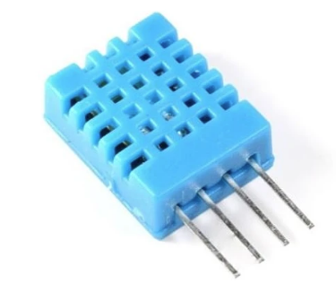

A partir de este sistema, se trabajarán los ejemplos en las guías de laboratorio. 

Ir a la guía:

### [2.3. Integración con sensores digitales.](2.3_practica_2_3_sensores_digitales.md)

## Integración de diversos dispositivos de entrada/salida

De acuerdo con las temáticas tratadas hasta este punto, a continuación se presenta un sistema embebido diseñado para el control de una casa inteligente. Puntualmente el encargado del sistema de alarma contra incendio. 

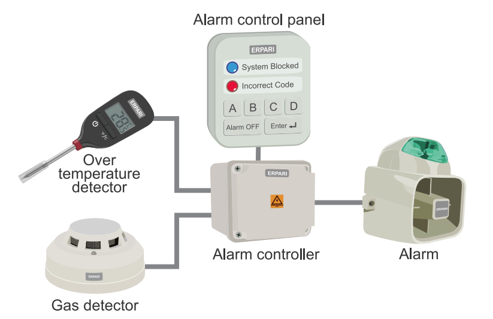

*Figura. Sistema básico de control de alarma de incendio. [Tomado de: [4], Chapter 1, p. 6](#referencias)*

Este sistema es potencialmente realizable usando plataformas de prototipado de sistemas embebidos. 

Para facilitar el entendimiento de la lógica del sistema, se harán algunas "abstracciones" de los dispositivos que se pueden observar en el diagrama. 

| Componente del sistema    | Abstracción |
| ------------------------- | ----------- |
| Alarm                     | LED LD1     |
| System blocked LED        | LED LD2     |
| Incorrect code LED        | LED LD3     |
| Alarm Off / Enter button  | Botón B1    |
| Gas detector              | Botón B1    |
| Over temperature detector | Botón B1    |
| A button                  | Botón B1    |
| B button                  | Botón B1    |
| C button                  | Botón B1    |
| C button                  | Botón B1    |

Por lo tanto, se requerirán los siguientes algunos materiales de hardware:

- Placa de desarrollo basada en SoC ESP-32.
- Cable de programación.
- 3 LED's (rojo, azul y verde).
- 7 botones.
- Cables duppont.

El sistema debe seguir la siguiente lógica:


*Figura adaptada de [[4]](#referencias)*

Inicialmente, se considerará la entrada del detector de gas. Si el detector de gas está activado, entonces se activará la alarma. Si no, la alarma estará desactivada. 

A continuación, se presenta una implementación posible para el problema planteado. 

```
// Incluir bibliotecas standar de C 
#include <stdio.h>   
#include <string.h>  

// Incluir biblioteca de control de pines GPIO del ESP-IDF
#include "driver/gpio.h"                

// Incluir biblioteca del sistema operativo FreeRTOS
#include "freertos/FreeRTOS.h" 

// Incluir biblioteca para manejo de tareas del FreeRTOS
#include "freertos/task.h" 


/* Crea macro con el número del pin donde está el detector de gas. 
 * Este detector de gas se activará con un pulso positivo.
 * Se debe hacer uso de la configuración Pull-Down de las entradas de la ESP32
 * Pra evitar errores de lectura y activaciones inesperadas. 
*/
#define DETECTOR_DE_GAS  2

/* Crea macro con el número del pin donde está la alarma. 
 * Esta alarma se activará con un pulso positivo.
 * Se debe hacer uso de la configuración Pull-Down de las entradas de la ESP32
 * Pra evitar errores de lectura y activaciones inesperadas. 
*/                           
#define ALARMA 4                  

// Macros para representar estados encendido (ON) y apagado (OFF)
#define ON  1
#define OFF 0

// Función principal del programa

void app_main(void)
{
    /* Reiniciar el pin del DETECTOR_DE_GAS para que 
     * esté en su estado predeterminado
     */
    gpio_reset_pin(DETECTOR_DE_GAS);   

    // Configura el pin del DETECTOR_DE_GAS como entrada
    gpio_set_direction(DETECTOR_DE_GAS, GPIO_MODE_INPUT);

    // Habilita la configuración Pull-Down en el pin del DETECTOR_DE_GAS
    gpio_pulldown_en(DETECTOR_DE_GAS);

    /* Reiniciar el pin de la ALARMA para que 
     * esté en su estado predeterminado
     */ 
        gpio_reset_pin(ALARMA);

    // Configura el pin de la ALARMA como salida
    gpio_set_direction(ALARMA, GPIO_MODE_OUTPUT);

    // Habilita la configuración Pull-Downen el pin de la alarma.
    gpio_pulldown_en(ALARMA);

    // Bucle infinito que permite que el programa se ejecute indefinidamente.
    while(1)
    {
        // Pregunta si el DETECTOR_DE_GAS está encendido
        if(DETECTOR_DE_GAS == ON)
        {
            // Solo si es verdadero, entonces se enciende la ALARMA
            gpio_set_level(ALARMA, ON);
        }
        // Pregunta si el DETECTOR_DE_GAS está apagado
        if (DETECTOR_DE_GAS == OFF)
        {
            // Solo si es verdadero, entonces se apaga la ALARMA
            gpio_set_level(ALARMA, OFF);
        }
    }
}
```

Las configuraciones `pull-down` y `pull-up`, permiten que los pines GPIO de la ESP32 puedan tener el comportamietno electrónico que se muestra en la imagen a continuación:


En la configuración `pull-down`, cuando se presiona el botón, se presentan 3.3 V en el pin GPIO conectado, lo que se entiende como un estado `HIGH` o `ALTO`; mientras el botón esté liberado, se presentará el valor de GND (0 V), lo que se entiende como un estado `LOW` o `BAJO`.

En la configuración `pull-up`, cuando se presiona el botón, se presenta el valor de GND (0 V) en el pin GPIO conectado, lo que se entiende como un estado `LOW` o `BAJO`; mientras el botón esté liberado, se presentará el valor de 3.3 V, lo que se entiende como un estado `HIGH` o `ALTO`.

Pruebe el código y vaya a la guía:

### [2.4. Integración de diversos dispositivos de entrada/salida](2.4_practica_integracion_disp_E_S.md)

## 2.5. Manejo del tiempo

El tiempo es un factor importante en todas las actividades humanas. Las máquinas no están exentas de considerar el parámetro tiempo. Es más, para las máquinas el tiempo es su parámetro más importante. 

Es así que, en este apartado se realizará un análisis de cómo se mide y se usa el tiempo en los microcontroladores y se aprenderá por qué es tan importante. 

### Temporizadores o *Timers*

En los microcontroladores el tiempo se mide a través de un módulo denominado en inglés como *"Timer"*, o lo mismo en español como *"Temporizador"*. Como su nombre lo indica, éste módulo se encarga de marcar o llevar el tiempo. 

En el SoC ESP32, este módulo recibe el nombre de "GPTimer" o *"General Purpose Timer"* y tiene las siguientes funcionalidades:

- Se puede usar como un reloj, ya que se puede obtener una marca de tiempo de alta resolución en cualquier momento. 
- Se pueden generar alarmas periódicas.
- Se puede generar una "alarma de un solo disparo" o "one-shot alarm".

ESP32 utiliza dos temporizadores de hardware con el fin de mantener la hora del sistema, para lo cual se puede pueden utilizar uno o ambos temporizadores. Los dos temporizadores de hardware son [[6]](#referencias):

- **Temporizador RTC:** este temporizador permite mantener el tiempo en varios modos de suspensión y también puede mantener el tiempo en cualquier reinicio (con la excepción de los reinicios de encendido que reinician el temporizador RTC). La desviación de frecuencia depende de las fuentes del reloj del temporizador RTC y afecta la precisión solo en los modos de suspensión, en cuyo caso el tiempo se medirá con una resolución de 6,6667 μs [[6]](#referencias).

- **Temporizador de alta resolución:** este temporizador no está disponible en los modos de suspensión y no persistirá durante un reinicio, pero tiene mayor precisión. El temporizador utiliza la fuente de reloj **APB_CLK** (normalmente 80 MHz), que tiene una desviación de frecuencia inferior a ±10 ppm. El tiempo se medirá con una resolución de 1 μs [[6]](#referencias).

### Pasos para crear un temporizador

Para crear un *Timer* con el *framework* ESP-IDF, es necesario realizar los siguientes pasos:

1. Inicializar una instancia con el tipo de dato `gptimer_handle_t`. Esta instancia o (variable) contendrá la configuración y funcionalidades del *Timer* [[6]](#referencias).

2. Instalar el driver para el *Timer*. Se requieren dos pasos:
   
   1. Inicializar la estructura del tipo `gptimer_config_t`, la cual contiene los siguientes tipos de datos [[6]](#referencias):
      - `.clk_src`: seleccionar la señal de reloj. Por defecto usar: `GPTIMER_CLK_SRC_APB`
      - `.direction`: seleccionar la dirección de conteo. Ascendente (`GPTIMER_COUNT_DOWN`) o descendente (`GPTIMER_COUNT_UP`). 
      - `.resolution_hz`: seleccionar  la resolución del contador (frecuencia de trabajo) en Hz, por lo tanto, el tamaño del paso de cada tic de conteo es igual a 1/resolución_hz segundos [[6]](#referencias).
   2. Configurar el *Timer* con la función `gptimer_new_timer()`, la cual recibe dos parámetros:
      - `config` – [in]. Es la dirección de memoria de la estructura que se creó en el paso 2.1. anterior [[6]](#referencias).
      - `ret_timer` – [out]. Es la dirección de memoria del *Handler* o instancia que se creó en el paso 1 [[6]](#referencias).

Aplicando lo anterior, se traduce en código como:

    ~~~
    // Paso 1.
    gptimer_handle_t gptimer = NULL;
    
    // Paso 2.1.
    gptimer_config_t timer_config = {
    
        .clk_src = GPTIMER_CLK_SRC_APB,
        .direction = GPTIMER_COUNT_UP,
        .resolution_hz = 1000000, // 1MHz, 1 tick = 1us
    
    };
    
    // Paso 2.2.
    ESP_ERROR_CHECK(gptimer_new_timer(&timer_config, &gptimer));
    ~~~

Código tomado de [[6]](#referencias).

### **Cambiar el valor de conteo de un temporizador**

Cuando se crea el GPTimer, el contador interno se restablecerá a cero de forma predeterminada. El valor del contador se puede actualizar asincrónicamente por`gptimer_set_raw_count()`. Al actualizar el recuento bruto de un temporizador activo, este comenzará a contar inmediatamente a partir del nuevo valor, así [[6]](#referencias):

`gptimer_set_raw_count([dir_memoria_timer_handle], [valor_nuevo])`

En este caso, se necesita proporcionar como parámetros el GPTimer a cambiar y un valor el cual se reemplazará como valor conteo [[6]](#referencias). 

### **Conteo máximo de un temporizador**

El valor de conteo máximo depende del ancho de bits del temporizador de hardware, que se refleja en la macro SOC SOC_TIMER_GROUP_COUNTER_BIT_WIDTH. Normalmente este valor es 64 bits. Por lo tanto, el valor máximo de conteo es `2^64 = 18.446.744.073.709.551.616` [[6]](#referencias).

### **Leer el valor de conteo de un temporizador**

El valor de conteo puede ser leído por `gptimer_get_raw_count()` en cualquier momento. 

`gptimer_get_raw_count([dir_memoria_timer_handle], uint64_t *[variable])`

En este caso, se necesita proporcionar como parámetros el GPTimer a consultar y un puntero a una variable para almacenar el valor leído en el temporizador; esta bariable debe ser del tipo uint64_t [[6]](#referencias) . 

### **Habilitar o deshabilitar un temporizador**

Antes de hacer operaciones con en el temporizador, primero debe habilitar, llamando a la función `gptimer_enable()`, así [[6]](#referencias):

`gptimer_enable([timer_handle])`

Esta función permite [[6]](#referencias):

- Cambiar el estado del controlador del temporizador desde init a habilitar.

- Habilite el servicio de interrupción si ha sido instalado de forma "débil" el `gptimer_register_event_callbacks()`.

- Permite tomar un plan de energía según la fuente de reloj seleccionada.

La función `gptimer_enable()` hace lo contrario [[6]](#referencias). 

`gptimer_enable([timer_handle])`

Vaya al *Ejercicio introductorio 1 de la práctica 2.5.* [Manejo del tiempo](2.5_practica_manejo_del_tiempo.md), donde encontrará un ejemplo de la implementación de lo aquí explicado. 

#### **Funciones de *callback***

Una función de *callback* es una función que se ejecuta cuando sucede un "evento" concreto, la cual es llamada a través de otra función. Tal es el caso que nos ocupa en este apartado relacionado con los temporizadores. 

El temporizador se puede configurar para que "avise" cuando se cumple un tiempo determinado, lo cual en ESP-IDF se conoce como una "alarma". Esto se configura de la siguiente manera:

1. Crear el temporizador, como se explicó en [Pasos para crear un temporizador](#pasos-para-crear-un-temporizador).

2. Crear la estructura para configurar las "alarmas" para los eventos del temporizador, así: 
   
   ```
    // Estructura para habilitar las alertas por eventos del temporizador
    gptimer_alarm_config_t alarm_config = {
        .reload_count = 0, // el contador se cargará con 0 en cada evento
        .alarm_count = 1000000, // periodo = 1s, resolución de 1MHz
        .flags.auto_reload_on_alarm = true, // habilita auto-carga
    };
   
    // Carga la configuración de alarma en el temporizador
    ESP_ERROR_CHECK(gptimer_set_alarm_action(gptimer, &alarm_config));
   
    // Se reserva un espacio de memoria en el heap para albergar la función de callback
    call_baks = malloc(sizeof(gptimer_event_callbacks_t));
   ```

3. Cargar la estructura de configuración definida anteriormente en el temporizador, usando la función: `gptimer_set_alarm_action(gptimer, &alarm_config)`.

4. Se declara y se define la función que será llamada cuando ocurra un evento del temporizador:
   
   ```
    static bool call_back_proof(gptimer_handle_t timer, gptimer_alarm_event_data_t *edata, void *User_data);
   ```
   
    A manera de ejemplo, a esta función se le dio el nombre de `call_back_proof`, pero esta puede tener el nombre que el programador le parezca mejor. Sin embargo, los parámetros de la función deben ser del mismo tipo de dato que éste, debido a la naturaleza de *puntero a  función* de las funciones de callback en el lenguaje C. En este sentido, sepa que la estructura `gptimer_event_callbacks_t`, es un puntero a función, que recibe como parámetros:
   
        - `gptimer_handle_t timer`: que es el timer creado por el usuario.
        - `gptimer_alarm_event_data_t *edata`: es una estructura interna creada por la propia función, que almacenan los datos del evento de alarma, los cuales son: 
            - `uint64_t count_value`: valor de conteo actual.
            - `uint64_t alarm_value`: valor de alarma actual.
        - `void *User_data`: datos que se pueden pasar como parámetro a la función de callback creada por el usuario. 
   
    Debido a que la función `call_back_proof()`, se ejecutará en tiempo de interrupción, no es recomendable usar lógica compleja dentro de ella o usar funciones del tipo bloqueante, como delays, printf(), entre otras. Si se emplean funciones bloqueantes o lógicas que demoren el tiempo de interrupción, el sistema se reiniciará forzosamente. 

5. Configurar la función de callback:
   1. Crear un puntero a función para almacenar la estructura del tipo `gptimer_event_callbacks_t`, la cual es la función que llamará a la función de callback que se creará.
   2. Luego reservar un espacio de memoria en el heap para evitar errores de espacio de memoria con la función malloc().
   3. Luego, se carga el puntero a la función creada en el paso 4. 
   4. Por último se carga la configuración de la estructura creada en el paso 5.1. en el temporizador. 

    ~~~
    // 5.1. Se crea un puntero del tipo gptimer_event_callbacks_t, que contendrá el llamado a función
    gptimer_event_callbacks_t *call_baks;
    
    // 5.2 Se reserva un espacio de memoria en el heap para albergar la función de callback
    call_baks = malloc(sizeof(gptimer_event_callbacks_t));
    
    // 5.3. Se asigna a la estructura call_baks creada anteriormente con el puntero a la función
    // que deberá llamar. 
    // la función que será llamada cuando ocurra el evento del temporizador.
    call_baks->on_alarm = call_back_proof;
    
    // 5.4. Se carga la configuración del callback en el temporizador. 
    gptimer_register_event_callbacks(gptimer, call_baks, NULL)
    ~~~

6. Por último, se habilita y se inicia el temporizador.
   
   ```
    // Habilita el temporizador
    ESP_ERROR_CHECK(gptimer_enable(gptimer));
   
    // Inicia el conteo del temporizador
    ESP_ERROR_CHECK(gptimer_start(gptimer));
   ```

Continue con la práctica 2.5. y vaya al apartado del ejercicio introductorio 2.

### [Práctica 2.5. Manejo del tiempo](2.5_practica_manejo_del_tiempo.md)

## 2.6. Integración con visualizadores

En el mundo de los sistemas embebidos, existen gran variedad de dispositivos que facilitan la visualización de datos. Estos dispositivos de visualización van desde simples pilotos (indicadores luminosos) hasta modernas pantallas OLED y touchscreens de alta resolución. 

En este curso se tratarán dos tipos de visualizadores:

1. Displays 7-segmentos.
2. Displays LCD.

### **Display 7-segmentos**

Un display de segmentos (o visualizador) es un componente electrónico que se utiliza para representar de manera limitada símbolos alfanuméricos, pero principalmente números. Como su propio nombre indica y, como se puede observar en la imagen siguiente, el display está compuesto por 7 segmentos y uno adicional que representa un punto, los cuales se encenderán o apagarán en función del símbolo a representar.

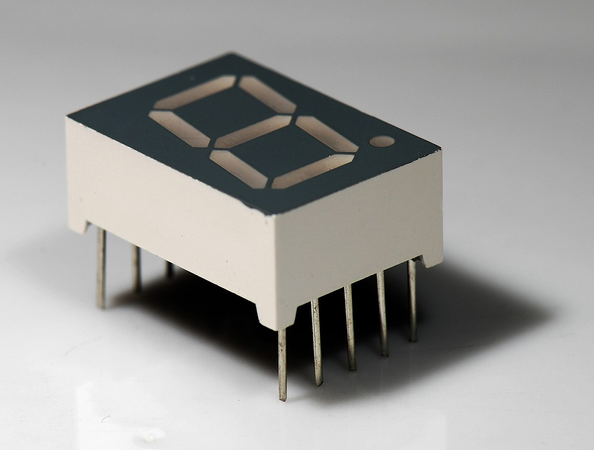

De forma interna, se asemeja a siete leds conectados estratégicamente formando el número 8, aunque externamente dicha semejanza no se observa. Cada uno de los segmentos que componen este display se denominan a, b, c, d, e, f y g, tal y como se muestra a continuación.

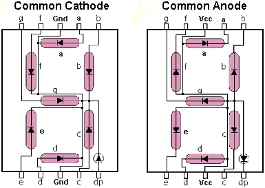

De modo que para mostrar el número 0, se tendrían que encender al mismo tiempo los segmentos a, b, c, d, e y f. Para el número 2, se tendrían que encender a, b, g, e y d. Y de la misma forma para cualquier otro número.

Existen dos tipos de Display 7 Segmentos según sus conexiones internas:

1. Configuración cátodo común: este tipo de display tiene una configuración interna en la que todos los cátodos de los leds están conectados entre sí. 

2. Configuración ánodo común: este tipo de display tiene una configuración interna en la que todos los ánodos de los leds están conectados entre sí.

### **Display LCD**

LCD es el acrónimo inglés para *Liquid Crystal Display*, o en español: *Pantalla de Cristal Líquido*. 

Las pantallas LCD están conformadas básicamente por dos placas de vidrio paralelas entre sí y separadas entre sí por algunos micrómetros, entre las cuales está presente un *cristal líquido*, el cual es un material que tiene propiedades físicas especiales y puede cambiar de aspecto en presencia de campos eléctricos o magnéticos. Entre las placas de vidrio se distribuyen electrodos que definen, con su forma, los símbolos o caracteres que se visualizarán [[7]](#referencias).

La superficie del vidrio que hace contacto con el líquido es tratada de manera que induzca la alineación de los cristales en dirección paralela a las placas. Esta alineación permite el paso de la luz sin ninguna alteración [[7]](#referencias).

Cuando se aplica la polarización adecuada entre los electrodos, aparece un campo eléctrico entre estos electrodos (campo que es perpendicular a las placas) y esto causa que las moléculas del liquido se agrupen en sentido paralelo a este (el campo eléctrico) y cause que aparezca una zona oscura sobre un fondo claro (contraste positivo). De esta manera aparece la información que se desea mostrar [[7]](#referencias).

A continuación, se muestran algunos ejemplos de displays LCD de pequeñas dimensiones.

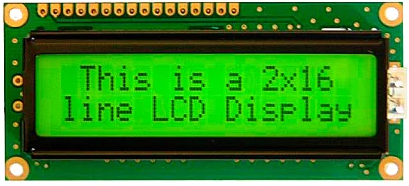

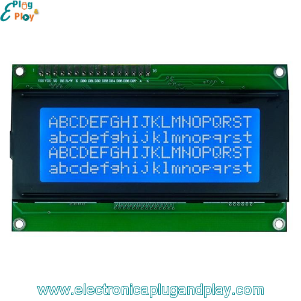


## 2.7. Integración con actuadores de control On-Off

## 2.8. Integración con actuadores de control continuo

## Referencias

- [1] TOCCI, RONALD J., NEAL S. WIDMER, GREGORY L. MOSS. Sistemas digitales. Principios y aplicaciones. Décima edición. Pearson Educación, México, 2007. ISBN: 978-970-26-0970-4. Área: Ingeniería. 

- [2] Thomas L. Floyd. FUNDAMENTOS DE SISTEMAS DIGITALES. PEARSON EDUCACIÓN S.A., Madrid, 2006. ISBN 10: 84-8322-085-7. ISBN 13: 978-84-832-2720-6.
    13.1 FUNDAMENTOS DEL PROCESAMIENTO DIGITAL DE LA SEÑAL Pág. 854
    Diagrama de bloques básico de un sistema típico de procesamiento digital de la señal Pág. 855
    Conversión analógico-digital Pág. 859
    13.3 MÉTODOS DE CONVERSIÓN ANALÓGICA-DIGITAL Pág. 862 

- [3] https://docs.espressif.com/projects/esp-idf/en/v4.2/esp32/api-reference/peripherals/adc.html

- [4] ARIEL LUTENBERG, PABLO GOMEZ, ERIC PERNIA. *A Beginner’s Guide to Designing Embedded System Applications on Arm® Cortex®-M Microcontrollers*. ARM Education Media. ISBN: 978-1-911531-42-5 (ePDF)

- [5] https://github.com/espressif/esp-idf/tree/v4.2/examples/peripherals/adc

- [6] https://docs.espressif.com/projects/esp-idf/en/latest/esp32/api-reference/system/system_time.html
- [7] https://www.samsung.com/latin/support/tv-audio-video/how-does-the-lcd-display-work/#:~:text=El%20LCD%20modifica%20la%20luz,dispositivo%20como%20un%20segmento%20oscuro.
