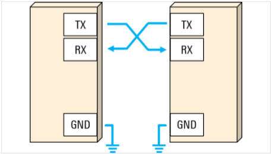

# Unidad 2 - Programación básica de Microcontroladores.

## Índice

- [2.1. Uso del periférico UART.](#21-uso-del-periférico-uart)
- [2.2. Integración de sensores analógicos.](#22-integración-de-sensores-analógicos)
- [2.3. Integración de sensores digitales.](#23-integración-de-sensores-digitales)
- [2.4. Manejo del tiempo.](#24-manejo-del-tiempo)
- [2.5. Integración con visualizadores.](#25-integración-con-visualizadores)
- [2.6. Integración con actuadores de control On-Off.](#26-integración-con-actuadores-de-control-on-off)
- [2.7. Integración con actuadores de control continuo.](#27-integración-con-actuadores-de-control-continuo)

## 2.1. Uso del periférico UART

Las siglas UART traducen: Universal Asynchronous Receiver/Transmitter (Transmisor/Receptor Asíncrono Universal). Este es un protocolo de comunicación serie entre dos dispositivos. Un ejemplo del uso de este protocolo es en la comunicación con interfaz RS-232. El protocolo UART utiliza dos líneas entre el transmisor y receptor para transmitir y recibir en ambas direcciones. La conexión se realiza de forma cruzada. Es decir, la línea de transmisión del primer dispositivo se conecta a la línea de transmisión del segundo y viceversa. La comunicación en el UART puede ser simplex, semidúplex, o full-dúplex. A continuación, se presenta un diagrama de conexión UART entre dos dispositivos:

*Figura 1. Conexión UART.*

### Es serie

Los datos en el protocolo UART se transmiten uno tras otro en el mismo canal (por eso es serie) en forma de tramas de bits. El formato y el contenido de estas tramas se describe y explica brevemente.

*Figura 2. Formato de Trama UART.*

El protocolo UART no define voltajes o rangos de voltaje específicos para los niveles lógicos de transmisión 0 o 1 (bajo o alto), esto va a depender específicamente de los fabricantes de chips. Por lo tanto, algunos autores llaman al nivel a alto como “marca” mientras que al nivel bajo lo llaman “espacio”. Mientras no se están trasmitiendo datos, la línea de transmisión se mantiene en estado alto, este estado también se le conoce como “estado Idle”. 

### Bits de start y stop

Ya que el UART es asíncrono, el transmisor necesita indicar que los bits de datos están llegando. Esto se logra utilizando el bit de inicio. El bit de inicio es una transición del estado alto de reposo a un estado bajo, y seguido inmediatamente por bits de datos de usuario.

Después de que se terminan los bits de datos, el bit de parada indica el fin de datos de usuario. El bit de parada es una transición de regreso al estado alto o Idle o permanece en el estado alto por un tiempo de bit adicional. Se puede configurar un segundo bit de parada (opcional), generalmente para darle tiempo al receptor de prepararse para la siguiente trama, pero esto no es común en la práctica.

### Bits de datos 

Los bits de datos son los datos de usuario o bits “útiles” y vienen inmediatamente después del bit de inicio. Puede haber de 5 a 9 bits de datos de usuario, aunque de 7 o 8 bits es lo más común. Estos bits de datos normalmente se transmiten primero con el bit menos importante.

### Bit de paridad

Una trama UART puede también contener un bit de paridad opcional que puede usarse para la detección de errores. Este bit se inserta entre el final de los bits de datos y el bit de parada. El valor del bit de paridad depende del tipo de paridad que esta siendo usado (par o impar):
En la paridad par, este bit se configura para que el total de números 1 en la trama será par.
En la paridad impar, este bit se configura para que el total de números 1 en la trama será impar

### Es asíncrono

El protocolo UART es asíncrono. Es decir, el transmisor y el receptor no comparten una señal de reloj. Esto ayuda a simplificar el protocolo, sin embargo, por esta misma razón el transmisor y el receptor deben “comprometerse” a transmitir a la misma velocidad, tener el mismo tamaño de trama y tener las mismas reglas de paridad para que la comunicación sea. Las velocidades de baudios del UART más comunes que se utilizan en estos días son 4800, 9600, 19.2K, 57.6K y 115.2K. 

### [Práctica 2.1. UART](2.1_practica_2_1_UART.md)

## 2.2. Integración de sensores analógicos

## 2.3. Integración de sensores digitales

## 2.4. Manejo del tiempo

## 2.5. Integración con visualizadores

## 2.6. Integración con actuadores de control On-Off

## 2.7. Integración con actuadores de control continuo

## Referencias

- [1] 

